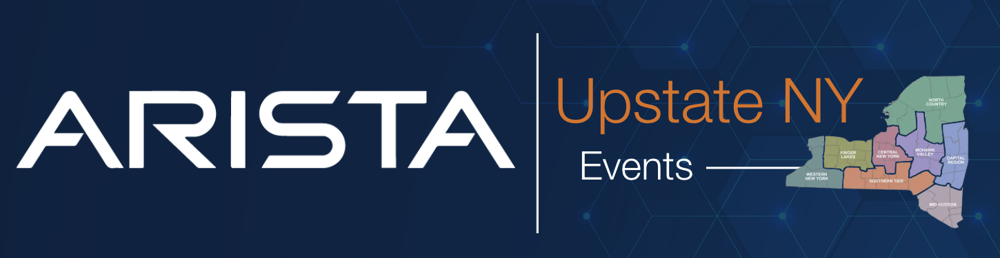
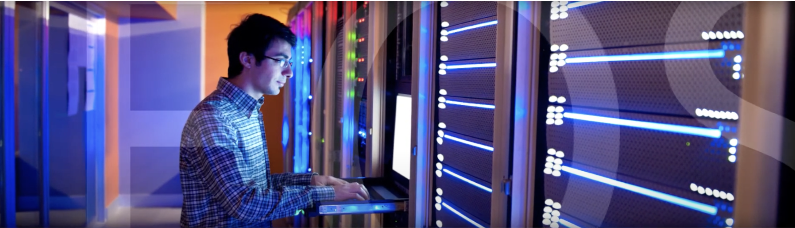
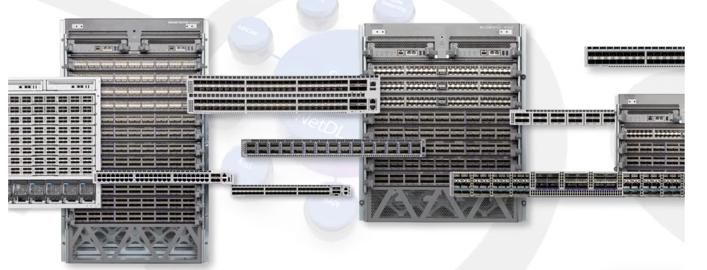
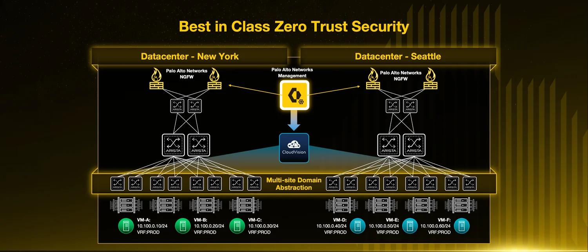
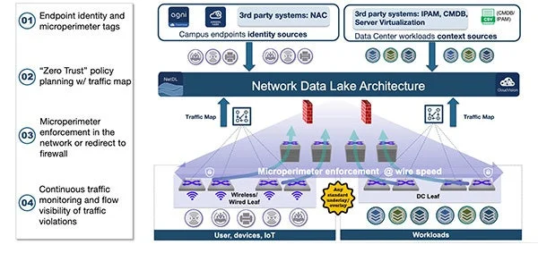

 

# Arista UpstateNY Region Newsletter

Welcome to the December 2025 newsletter for Arista customers in the U.S. Upstate NY Region!

 
We welcome your feedback on the newsletter. If you have any ideas on what you want to see, please reach out to [UpstateNY@arista.com](mailto:UpstateNY@arista.com)
 

---

## __*Upcoming Events*__ 🗓️
Arista hosts various events throughout the year for you! Members of our team organize these informative events to showcase Arista's ability to not only help improve your network, but to also assist by providing a set of tools to improve your operations! Click on the boxes below to be directed to Arista's website for lists of Webinars and Events.

-   __Local Upstate NY Events__

    

<figure markdown>
{: style="height:500px;width:800px"} 
    <figcaption>  </figcaption>
</figure>

-   __Global Webinars__  

    --- 

    We make it easy for you to view products that are of interest, all virtually! Technical members of the team showcase outstanding explanation of the products. Click below to see our list of Webinars. 

    [Arista Webinars](https://www.arista.com/en/company/news/webinars){.md-button}

-   __Global Events__ 

    ---
    Join us in person to get a closer look in our list of products and solution, as well as get the chance to meet members of the team. Click below to see our list of upcoming Events. 

    [Upcoming Events](https://www.arista.com/en/company/news/events){ .md-button }

--- 

## __*Software Updates*__ ⚙️

-   <!-- empty list item just to wrap the card content -->

    

    | **Software**     | **Version**                                        | **Release Date**                                    |
    |------------------|----------------------------------------------------|-----------------------------------------------------|
    | **EOS**          | 4.35.0.1F NEW   4.34.4M NEW   4.33.6M NEW   4.32.8M   4.31.9M   4.30.10M   | Nov 19th, 2025   Dec 1st, 2025   Nov 21st, 2025   Oct 24th, 2025   Sept 4th, 2025   April 18th, 2025 |
    | **CVP**          | Portal 2025.2.2    Appliance 7.1.0   Sensor 1.3.0 NEW | Sept 15th, 2025   Sept 2nd, 2025   Dec 5th, 2025 |
    | **DMF**          | 8.8.0   8.7.2   8.6.2   8.5.3                                   | August 15th, 2025   July 25th, 2025   June 23rd, 2025   June 20th, 2025 |
    | **WLAN**         | CV-CUE 20.0.0-179   AP-21 21.0.0-88vv6 NEW   AP-20 20.0.0-183vv3    AP-19 19.0.0-183vv21 NEW                             | August 20th, 2025   Nov 12th, 2025   Sept 16th, 2025   Nov 13th, 2025  |
    | **Arista NDR**   | 5.3.5                  | June 2025 |
    | **TerminAttr**   | 1.40.3                                             | Sept 22nd, 2025 |
    | **VeloCloud**    | Orchestrator 6.4.1   Gateway 6.4.1 NEW   Edge 6.4.1 NEW | Oct 2025   Nov 26th, 2025   Nov 26th, 2025 |

    For all code releases, click [here](https://www.arista.com/en/support/software-download)

---

## __*Software Advisories*__ 🚨

-   <!-- empty list item just to wrap the card content -->

    

    To view more details, click the advisory links below.

    | **Name** | **Advisory Link** | **Date** |
    |:--------:|:-----------------:|:--------:|
    | IPSec | [Advisory 0127](https://www.arista.com/en/support/advisories-notices/security-advisory/22869-security-advisory-0127) NEW  | Nov 18, 2025   Update: Sept 30, 2025  |
    | CVX / MCS | [Advisory 0126](https://www.arista.com/en/support/advisories-notices/security-advisory/22868-security-advisory-0126) NEW  | Nov 18, 2025  |
    | Console input might result in an unexpected reload | [Advisory 0125](https://www.arista.com/en/support/advisories-notices/security-advisory/22811-security-advisory-0125) NEW | Nov 11, 2025  |
    | DMF / CCF / CVA / MCD | [Advisory 0124](https://www.arista.com/en/support/advisories-notices/security-advisory/22538-security-advisory-0124)  | Oct 22, 2025   Update: Sept 30, 2025  |
    | Edge Threat Management / NG Firewall | [Advisory 0123](https://www.arista.com/en/support/advisories-notices/security-advisory/22535-security-advisory-0123)  | Oct 21, 2025  |
    | Encryption key configuration may be logged in clear text | [Advisory 0122](https://www.arista.com/en/support/advisories-notices/security-advisory/22022-security-advisory-0122) | July 22, 2025   Update: Sept 30, 2025  |
    | Maliciously formed UDP packets | [Advisory 0121](https://www.arista.com/en/support/advisories-notices/security-advisory/22021-security-advisory-0121) | July 22, 2025   Update: Sept 30, 2025  |
    | ACL policies may not be enforced | [Advisory 0120](https://www.arista.com/en/support/advisories-notices/security-advisory/21414-security-advisory-0120) | May 27, 2025 |
    | IPsec may exhibit unexpected behavior | [Advisory 0119](https://www.arista.com/en/support/advisories-notices/security-advisory/21413-security-advisory-0119) | May 27, 2025   Update: June 4, 2025 |
    | VLAN isolation and segmentation boundaries | [Advisory 0118](https://www.arista.com/en/support/advisories-notices/security-advisory/21411-security-advisory-0118) | May 20, 2025 |
    | Remote-server credentials | [Advisory 0117](https://www.arista.com/en/support/advisories-notices/security-advisory/21394-security-advisory-0117) | May 6, 2025   Update: May 20, 2025 |
    | Time Bound Device Onboarding | [Advisory 0116](https://www.arista.com/en/support/advisories-notices/security-advisory/21316-security-advisory-0116) | April 15, 2025 |
    | ZTP Admin Privileges | [Advisory 0115](https://www.arista.com/en/support/advisories-notices/security-advisory/21315-security-advisory-0115) | April 15, 2025 |
    | Malicious Authenticated User | [Advisory 0114](https://www.arista.com/en/support/advisories-notices/security-advisory/21314-security-advisory-0114) | April 15, 2025 |
    | EOS Secure VxLAN | [Advisory 0113](https://www.arista.com/en/support/advisories-notices/security-advisory/21289-security-advisory-0113) | April 8, 2025 |
    | OpenSSH | [Advisory 0100](https://www.arista.com/en/support/advisories-notices/security-advisory/19904-security-advisory-0100) | July 8, 2025   Update: Sept 29, 2025  |

    For a list of the most current advisories and notices, click [Here](https://www.arista.com/en/support/advisories-notices)

---

## __*Product Updates*__  🏷️

- <!-- empty list item to wrap content -->

    

    **End of Sale** notices are listed below.  
    **Field Notices** NOT related to End of Sale can be found [here](https://www.arista.com/en/support/advisories-notices/fieldnotice)  

    <table>
      <thead>
        <tr>
          <th><b>Device</b></th>
          <th><b>Name</b></th>
          <th><b>End Of Sale Date</b></th>
        </tr>
      </thead>
      <tbody>
        <tr>
          <td>Software</td>
          <td>
            <a href="https://www.arista.com/en/support/advisories-notices/end-of-support/21089-end-of-software-support-for-7280r-r2-7500r-r2-and-7020r-series">EOS-4.34 and later no longer supported on select switches</a> 
            <a href="https://www.arista.com/en/support/advisories-notices/end-of-support/21094-end-of-support-for-dmf-and-ccf-deployments-on-accton-edgecore-switches">DMF and CCF Deployments on Accton/ Edgecore Switches</a> 
            <a href="https://www.arista.com/en/support/advisories-notices/end-of-support/21275-end-of-software-support-for-eos-4-28">End of Software Support for EOS 4.28</a> 
            <a href="https://www.arista.com/en/support/advisories-notices/end-of-support/21362-end-of-software-support-for-cloud-builder">CloudVision CloudBuilder 2025.1</a> 
            <a href="https://www.arista.com/en/support/advisories-notices/end-of-support/21417-end-of-software-support-for-dmf-8-3">DMF 8.3</a> 
            <a href="https://www.arista.com/en/support/advisories-notices/end-of-support/21627-end-of-software-support-for-cloudvision-portal-2023-3-release-train">CloudVision Portal 2023.3 Train</a> 
            <a href="https://www.arista.com/en/support/advisories-notices/end-of-sale/21653-end-of-sale-end-of-life-for-velocloud-software-defined-sd-access">VeloCloud Software Defined (SD) Access</a> 
            <a href="https://www.arista.com/en/support/advisories-notices/end-of-sale/22072-end-of-sale-life-velocloud-sase-secured-symantec">VeloCloud SASE Secured by Symantec</a>  
            <a href="https://www.arista.com/en/support/advisories-notices/end-of-support/22004-end-of-software-support-for-cvp-ipam-application">CloudVision IPAM Application 2025.1</a>  
            <a href="https://www.arista.com/en/support/advisories-notices/field-notice/22238-field-notice-0111">CloudVision Portal 2025.2.1</a>   
            <a href="https://www.arista.com/en/support/advisories-notices/field-notice/22238-field-notice-0111">CloudVision Portal 2025.2.0</a>  
            <a href="https://www.arista.com/en/support/advisories-notices/field-notice/22237-field-notice-0110">CloudVision Portal 2025.1.2</a>  
            <a href="https://www.arista.com/en/support/advisories-notices/end-of-support/22429-end-of-software-support-for-eos-4-29">EOS 4.29</a>   
            <a href="https://www.arista.com/en/support/advisories-notices/end-of-sale/22430-end-of-sale-end-of-life-for-arista-ccf-product-line">CCF Product Line</a>   
            <a href="https://www.arista.com/en/support/advisories-notices/end-of-support/22431-end-of-software-support-for-cloudvision-portal-2024-1-release-train">CloudVision Portal 2024.1</a>   
          </td>
          <td>
            January 15, 2025 
            January 31, 2025 
            March 14, 2025 
            April 30, 2025 
            June 3, 2025 
            June 17, 2025 
            July 1, 2025 
            July 1, 2025 
            July 14, 2025 
            Sept 3, 2025 
            Sept 3, 2025 
            Sept 4, 2025 
            Sept 26, 2025 
            Oct 1, 2025 
            Oct 2, 2025
          </td>
        </tr>  
        <tr>
          <td>Module</td>
          <td><a href="https://www.arista.com/en/support/advisories-notices/end-of-sale/18886-end-of-sale-of-the-arista-7500r2-series-line-cards">7500R2 Series Linecards</a></td>
          <td>December 20, 2023</td>
        </tr>
        <tr>
          <td>Access Points</td>
          <td>
            <a href="https://www.arista.com/en/support/advisories-notices/end-of-sale/20652-end-of-sale-of-ap-model-w-118">AP Model W-118</a>  
            <a href="https://www.arista.com/en/support/advisories-notices/end-of-sale/22536-end-of-sale-of-ap-mounts-mnt-ap-flat-c130-mnt-ap-flat-c100-mnt-ap-flat-14cm-a">MNT-AP-FLAT-C130/C100/14CM-A</a> 
          </td>  
          <td>
            November 20, 2024  
            October 22, 2025
          </td>  
        </tr>
        <tr>
          <td>DMF</td>
          <td>
            <a href="https://www.arista.com/en/support/advisories-notices/end-of-sale/21087-end-of-sale-end-of-life-for-arista-recorder-node-appliance-dca-dm-ra3">Recorder Node DCA-DM-RA3</a> 
            <a href="https://www.arista.com/en/support/advisories-notices/end-of-sale/21416-end-of-sale-end-of-life-for-arista-recorder-node-appliance-dca-dm-sel">Service Node DCA-DM-SEL</a> 
            <a href="https://www.arista.com/en/support/advisories-notices/end-of-sale/21648-end-of-sale-end-of-life-for-arista-service-node-appliance-dca-dm-sdl">Service Node DCA-DM-SDL</a> 
            <a href="https://www.arista.com/en/support/advisories-notices/end-of-sale/22537-end-of-sale-end-of-life-for-arista-service-node-appliance-dca-dm-sc2">Service Node DCA-DM-SC2</a> 
          </td>
          <td>
            January 14, 2025 
            June 3, 2025 
            July 1, 2025 
            October 22, 2025
          </td>
        </tr>
        <tr>
          <td>Switches</td>
          <td>
            <a href="https://www.arista.com/en/support/advisories-notices/end-of-sale/21052-end-of-sale-of-the-arista-dcs-7020r-series">DCS-7020R Series</a> 
            <a href="https://www.arista.com/en/support/advisories-notices/end-of-sale/22401-end-of-sale-of-the-arista-ccs-710p-12-switch">CCS-710P-12</a> 
            <a href="https://www.arista.com/en/support/advisories-notices/end-of-sale/22402-end-of-sale-of-the-arista-ccs-720d-switches-with-4gb-dram">CCS-720DP-24S</a> 
            <a href="https://www.arista.com/en/support/advisories-notices/end-of-sale/22402-end-of-sale-of-the-arista-ccs-720d-switches-with-4gb-dram">CCS-720DP-48S</a> 
            <a href="https://www.arista.com/en/support/advisories-notices/end-of-sale/22402-end-of-sale-of-the-arista-ccs-720d-switches-with-4gb-dram">CCS-720DT-24S</a> 
            <a href="https://www.arista.com/en/support/advisories-notices/end-of-sale/22402-end-of-sale-of-the-arista-ccs-720d-switches-with-4gb-dram">CCS-720DF-48Y</a> 
            <a href="https://www.arista.com/en/support/advisories-notices/end-of-sale/22403-end-of-sale-of-the-arista-ccs-720xp-96zc2-switches-with-4gb-dram">CCS-720XP-96ZC2</a> 
            <a href="https://www.arista.com/en/support/advisories-notices/end-of-sale/22421-end-of-sale-of-the-arista-7010tx-48-dc-switches">DCS-7010TX-48-DC</a>  
            <a href="https://www.arista.com/en/support/advisories-notices/end-of-sale/22420-end-of-sale-of-the-arista-7010tx-48-switches">DCS-7010TX-48</a>  
            <a href="https://www.arista.com/en/support/advisories-notices/end-of-sale/22419-end-of-sale-of-the-arista-7050cx3-32s-switches">DCS-7050CX3-32S</a> 
          </td>
          <td>
            December 20, 2025 
            September 12, 2025 
            September 12, 2025 
            September 12, 2025 
            September 12, 2025 
            September 12, 2025 
            September 12, 2025 
            September 19, 2025 
            September 19, 2025 
            September 19, 2025
          </td>
        </tr>
        <tr>          
          <td>VeloCloud</td>
          <td>
            <a href="https://www.arista.com/en/support/advisories-notices/end-of-sale/22556-end-of-sale-of-the-arista-edge-threat-management-micro-edge-q6e-and-q6ewl-series">Micro Edge Q6E and Q6EWL Series</a> 
          </td>
          <td>
            November 5, 2025
          </td>          
      </tbody>
    </table>

- <!-- empty list item to wrap content -->

    **New Releases** of Arista devices are listed below.

    <table>
      <thead>
        <tr>
          <th><b>Device</b></th>
          <th><b>More Information</b></th>
          <th><b>Release Date</b></th>
        </tr>
      </thead>
      <tbody>
        <tr>
          <td>Arista and Palo Alto Networks Strengthen Partnership in the New Age of AI Security NEW</td> 
          <td><a href="https://blogs.arista.com/blog/arista-and-palo-alto-networks-strengthen-partnership-in-the-new-age-of-ai-security">Arista’s EOS® foundation, accompanied by AVA, along with Palo Alto</a></td>
          <td>Q4 2025</td>
        </tr>      
        <tr>
          <td>Arista's Next Generation Data and AI Center Hardware </td> 
          <td><a href="https://www.arista.com/en/company/news/press-release/22541-pr-10292025">New 800G R4 series portfolio accelerates routing and AI at scale</a></td>
          <td>Q4 2025</td>
        </tr>      
        <tr>
          <td>Arista VeloCloud</td>
          <td><a href="https://www.arista.com/en/company/news/press-release/21646-pr-07012025">Expanded AI-Driven Campus and Branch Networking Offerings</a></td>
          <td>Q3 2025</td>
        </tr>
        <tr>
          <td>Arista Cluster Load Balancing (CLB)</td>
          <td><a href="https://www.arista.com/en/company/news/press-release/21271-pr-20250312">Intelligent Innovations for AI Networking</a></td>
          <td>Q2 2025</td>
        </tr>
        <tr>
          <td>The Ultra Ethernet Consortium</td>
          <td><a href="https://youtu.be/jfC-1u8BR4Y">A major milestone in redefining Ethernet for the AI and HPC</a></td>
          <td>Q2 2025</td>
        </tr>
        <tr>
          <td>Arista SWAG</td>
          <td><a href="https://www.arista.com/en/company/news/press-release/20693-pr-12032024">Modern Stacking for Campus</a></td>
          <td>Q1 2025</td>
        </tr>
      </tbody>
    </table>

---

## **Spotlight** 🔦 

<strong>Take a look at New 800G R4 series portfolio!</strong> 

  <iframe src="https://www.youtube-nocookie.com/embed/1DAlLYqxj44?rel=0&modestbranding=1" style="position:absolute;top:0;left:0;width:100%;height:100%;" frameborder="0" allowfullscreen></iframe>

 
 

<strong>Take a look at these Arista testimonials from an A-List of A.I. industry luminaries!</strong> 

  <iframe src="https://www.youtube.com/embed/FzwydqLKHxI?rel=0&wmode=transparent" style="position:absolute;top:0;left:0;width:100%;height:100%;" frameborder="0" allowfullscreen></iframe>

---

## **Article #1 - Network and Security Engineering: Did We Just Become Best Friends?**
By: Joseph Mitri, Senior Systems Engineer, Upstate NY Region

For decades, network and security teams have worked toward the same business goal: keep applications reachable and protected. But the way they approach that goal has often pulled in different directions.

Picture the environment, whether a data center or campus, as a massive transportation system. The applications are the cars moving across it, each with its own purpose and performance profile. The users operating those applications are the drivers behind the wheel. The network is the highway system built to move those cars and drivers quickly and efficiently. And the security stack, including firewalls, NAC, identity, and segmentation systems, are the collection of border crossings, toll booths, and inspection points that check who is traveling, what they are carrying, and whether they should be allowed down a particular path.

Network engineers have traditionally played the role of the Department of Transportation. Their job is to keep the roads wide, predictable, redundant, and fast.  Avoiding detours, eliminating bottlenecks, and making sure the entire system stays up and running.

Security teams, whether focused on firewall policy, NAC enforcement, user identity, device posture, or segmentation, operate more like a coordinated border authority. Their mission is to validate drivers, inspect cargo, enforce the rules of the road, and prevent unauthorized movement. That often means introducing checkpoints or routing traffic through specific paths to ensure proper inspection.

And that is where the familiar tension has always lived. The network prefers open highways. Security prefers controlled checkpoints. The cars and drivers, meaning our apps and users, sit in the middle of that push and pull.

  Enter Arista MSS: A modern traffic model that unifies network performance with security enforcement

Arista Multi-Domain Segmentation Services (MSS) eliminates the need to steer traffic through a handful of centralized inspection points. Instead, it allows security policy to be enforced directly on the switching infrastructure. 

The switches, already designed for performance, apply policy at line rate without detours, hairpinning, or unnecessary latency.

 - Security teams continue defining the policy and intent centrally.
 - The network enforces those decisions consistently and immediately.
 - Traffic moves the way it always should have: fast, predictable, and secure.

  <iframe src="https://www.youtube.com/embed/yHgPwDmqtj0" style="position:absolute;top:0;left:0;width:100%;height:100%;" frameborder="0" allowfullscreen></iframe>

  Arista MSS in the Data Center: Strengthened by a new Palo Alto Networks partnership

MSS becomes even more powerful through the collaboration between Arista and Palo Alto Networks. Palo Alto firewalls remain the authoritative source of rich security intelligence, identity context, and application-level policy, while Arista distributes that policy throughout the data center fabric for enforcement at line rate.

<figure markdown>
{: style="height:350px;width:800px"} 
    <figcaption>  </figcaption>
</figure>

  <a href="https://blogs.arista.com/blog/arista-and-palo-alto-networks-strengthen-partnership-in-the-new-age-of-ai-security" target="_blank">https://blogs.arista.com/blog/arista-and-palo-alto-networks-strengthen-partnership-in-the-new-age-of-ai-security</a>

  Arista MSS in the Campus

MSS integrates with [Arista AGNI](https://www.arista.com/en/products/network-access-control) or third-party NAC platforms to assign tags based on identity, role, device type, posture, OS version, risk level, or location. All of this happens without relying on VLANs or complex macro-segmentation.

<figure markdown>
{: style="height:300px;width:800px"} 
    <figcaption>  </figcaption>
</figure>

  <a href="https://www.arista.com/en/products/multi-domain-segmentation" target="_blank">https://www.arista.com/en/products/multi-domain-segmentation</a>

  In summary

Arista MSS brings a unified Zero Trust architecture to both data center and campus networks. It aligns network performance with security intent rather than forcing one to sacrifice for the other.

If you would like to hear more about Arista MSS, do not hesitate to reach out to your Arista account team.

---

## **Article #2 - Arista 2025: The Year Ethernet Took Over AI Networking** 
By: Jeramiah Pauly, Associate Account Manager - Upstate NY Region

2025 will be remembered as a defining year for Arista Networks. Few companies in infrastructure managed to balance technical innovation, market expansion, leadership focus, and operational clarity the way Arista did over these twelve months. While the networking industry debated AI claims, cloud fragmentation, and edge complexity, Arista demonstrated something rare: a clear strategy paired with consistent execution at scale.

  AI Networking Became the Story and Arista Owned It

In March of this year, one message became very clear. Ethernet will win the AI networking battle. CEO Jayshree Ullal articulated this several times throughout 2025, positioning Arista not as a hyperscale only vendor but as the company building deterministic, high performance fabrics for GPU dense environments.

Between the release of the [EOS Smart AI Suite](https://www.arista.com/en/company/news/press-release/21271-pr-20250312) and new platforms designed for AI job aware observability, intelligent load balancing, and GPU traffic optimization, Arista delivered a simple reality to the market. AI networking is a real workload with real requirements. It is not marketing language.

Multiple product launches throughout the year illustrated a tactical and disciplined approach that did not rely on a single announcement or a single device. Arista delivered:

- [Modular switches](https://www.arista.com/en/company/news/press-release/22541-pr-10292025) that support scale out and scale up
- New AI data center platforms designed for GPU fabric performance
- A fully developed AI networking portfolio, not a single SKU

This was not one AI device. It was a complete architecture with the software to operate and observe it.

  Ultra Ethernet Consortium Became the Blueprint for AI Fabric Scale

All of this momentum centered around a fundamental architectural model: Ultra Ethernet Consortium, also known as UEC. In 2025 Arista moved from theory to practice and showed real customers how to deliver large scale AI environments using Ethernet in predictable and repeatable ways.

[UEC](https://blogs.arista.com/blog/demystifying-ultra-ethernet) addressed three critical requirements that every AI focused customer wrestled with:

- East west GPU traffic performance for training
- Lossless Ethernet without proprietary transport requirements
- Operational control for thousands of AI servers

UEC delivered traffic engineering with EOS, real time fabric observability with [CloudVision](https://www.arista.com/en/products/eos/eos-cloudvision), and job aware congestion control with Smart AI Suite. The most important outcome was simplicity. UEC turned AI design into an implementation decision, not an academic argument.

  Leadership Moved From Confidence to Acceleration

2025 was also a leadership story for Arista.

The appointment of former Cisco Meraki leader [Todd Nightingale](https://www.youtube.com/watch?v=qkBax7_CT-E) as Chief Operating Officer signaled operational discipline and a renewed focus on scaling the business.

An experienced AWS executive, [Tyson Lamoreaux](https://www.sdxcentral.com/news/arista-networks-shuffle-sees-aws-veteran-join-for-cloud-and-ai-pivot/), joined Arista to accelerate the data center business. This confirmed that Arista is no longer just a switching company. It is a global cloud infrastructure company.

[Jayshree Ullal](https://blogs.arista.com/blog/generative-and-agentic-ai-networking-revolution) continued to lead through credibility and clarity, reinforcing the same straightforward idea throughout the year. Open standards, Ethernet, and automation will win.

Viewed together, Arista evolved leadership around scale, systems thinking, and global presence, not only product development.

  Global Expansion Was Not Talk. It Was Investment

Many companies reference global scale without evidence. Arista acted.

The company announced a [one billion dollar investment](https://www.arista.com/en/company/news/press-release/22031-pr-20250730) in India. This was not a marketing event. It was a long term commitment to engineering talent, manufacturing depth, and go to market investment.

Arista recognized early that the AI era requires global supply chains, distributed development teams, and resilient operations.

  Customer Proof Was More Persuasive Than Any Presentation

The most underrated part of 2025 was something simple. Customers saw real outcomes.

A clear example came from John Camille, a network administrator in Upstate New York, who stated the following:

“Transitioning to Arista has been completely eye opening. Arista clearly and regularly demonstrates what networking can and should be like.”

This was not a case study with five bullet points. It was the voice of a practitioner seeing daily improvement.

  Campus Portfolio Momentum Continued to Build

Multiple reports throughout the year indicated that Arista moved beyond the legacy perception of being a hyperscale technology company. Enterprises embraced Arista as a strategic choice for campus, data center, WAN, and AI workloads.

Arista demonstrated that one operating model can produce consistent outcomes across entirely different environments.

See more global customer success stories with our campus products [here](https://www.arista.com/en/company/customer-testimonials/solutions/campus-wi-fi).

  WAN Became Strategic Again and VeloCloud Provided the Catalyst

One of the most important moves of 2025 did not take place in the data center. It took place at the edge.

While the industry focused on AI fabrics and GPU transport challenges, Arista concentrated on the WAN and [acquiring VeloCloud](https://www.arista.com/en/company/news/press-release/21646-pr-07012025) from Broadcom became the turning point.

The narrative changed very quickly.

Enterprises asked for cloud on ramps that reflected Arista principles, not bolt on point solutions. Network teams asked a single question. How do we simplify policy across branches, WANs, and data centers using one operating model and one source of truth.

VeloCloud delivered that bridge. It unified operational practice. It gave Arista the same advantage in WAN that EOS gave them in the data center: one platform and one method of control.

  So What Really Happened in 2025

Arista did not chase AI. Arista architected it. Arista leads the industry with the #1 market share in data center switching. Our Smart Etherlink™ 800G AI platforms have made Ethernet the de facto standard for the AI data center.

2025 was the year Arista:

- Demonstrated that Ethernet can support GPU fabric transport at scale
- Built a global operational footprint delivering clarity in a noisy infrastructure market
- Strengthened leadership to support long term execution

And throughout every major development one platform remained constant.

EOS delivered:

- Low vulnerability scores
- One operating model
- One source of truth
- Automation first operations

  Final Reflection

If 2023 and 2024 were the years Arista promised simplification at scale then 2025 became the year Arista delivered it across AI, enterprise, WAN, and cloud routing together.

The most important part of this year is not a single launch or a single technology breakthrough. It is the consistency of approach while the industry tried to reinvent itself in real time.

Arista will enter 2026 without hype and without noise. It now moves forward with durable momentum based on execution, not expectation.

---

## **A 2025 Wrap Up** 

As we wrap up 2025, I want to take a moment to say thank you. Whether we met in a meeting room, a design session, a training event, or somewhere in between, I’ve genuinely appreciated every conversation, every challenge we solved together, and every opportunity we had to build something better.

This community continues to grow because of your curiosity, your willingness to try new ideas, and your commitment to doing things the right way. It’s been a privilege to support you this year, and I’m looking forward to everything we’ll take on together in 2026.

Wishing you and your families a safe, healthy, and relaxing holiday season. Enjoy the time off, recharge, and come back ready for a new year full of upgrades and new capabilities for your network.

Happy Holidays, and all the best in the year ahead!

---
# *Feel Free to Reach Out To Us For Your Network Needs* 
<figure markdown>
{: style="height:300px;width:800px"}  
    <figcaption></figcaption>
</figure>
We thank you for taking the time to read our newsletter today. Feel free to reach out to your SE or ASE for more information or questions regarding your network operations. Until next month, have a good one! 