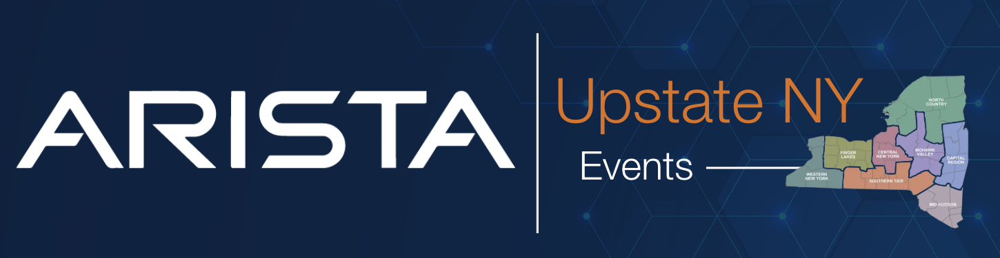
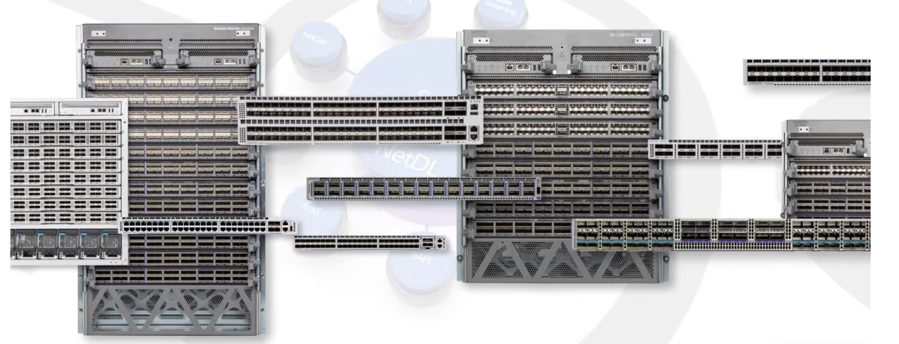
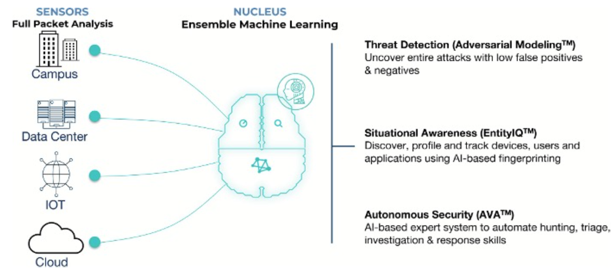

 

# Arista UpstateNY Region Newsletter

Welcome to the October 2025 newsletter for Arista customers in the U.S. Upstate NY Region!

 
We welcome your feedback on the newsletter. If you have any ideas on what you want to see, please reach out to [UpstateNY@arista.com](mailto:UpstateNY@arista.com)
 

---

## __*Upcoming Events*__  
Arista hosts various events throughout the year for you! Members of our team organize these informative events to showcase Arista's ability to not only help improve your network, but to also assist by providing a set of tools to improve your operations! Click on the boxes below to be directed to Arista's website for lists of Webinars and Events.

-   __Local Upstate NY Events__

    

    | Date         | Name                                     | Description                                                                                                                                                                                                                         | Location & Registration                                                                                       |
    |--------------|------------------------------------------|-------------------------------------------------------------------------------------------------------------------------------------------------------------------------------------------------------------------------------------|-------------------------------------------------------------------------------------------------------------|
    | __October 15__  | Build a Smarter Network (Local Gov) | Discover how New York towns and counties are modernizing networks to cut costs, simplify IT, and boost security.                                                                    | Webinar  [Register](https://arista.zoom.us/meeting/register/TnfmX2KfRQWiRgPMydXBRA#/registration){.register-link}                    |
    | __October 23__  | Arista Campus Networking Day   | Join us at Camp Arista where your guides will cover a range of technical topics and showcase innovative solutions.                                                                    | Syracuse NY  [Register](https://events.arista.com/2025-campus-networking-day-syracuse-ny){.register-link}                               |
    | __December&nbsp;4__  | NetDevOps: Network Automation Workshop **Part 1of2** NEW | Automation Fundamentals                                                                    | Rochester NY  [Register](https://events.arista.com/2025-12-4-arista-netdevops-automation-fundamentals-workshop-rochester-ny){.register-link}                    |
    | __December&nbsp;11__ | NetDevOps: Network Automation Workshop **Part 2of2** NEW | CI using Arista Vaildated Diesgns (AVD)                                                                    | Rochester NY  [Register](https://events.arista.com/12-11-network-automation-workshop-ci-avd-rochester-ny){.register-link}                               |

-   __Global Webinars__  

    --- 

    We make it easy for you to view products that are of interest, all virtually! Technical members of the team showcase outstanding explanation of the products. Click below to see our list of Webinars. 

    [Arista Webinars](https://www.arista.com/en/company/news/webinars){.md-button}

-   __Global Events__ 

    ---
    Join us in person to get a closer look in our list of products and solution, as well as get the chance to meet members of the team. Click below to see our list of upcoming Events. 

    [Upcoming Events](https://www.arista.com/en/company/news/events){ .md-button }

--- 

## __*Software Updates*__

-   <!-- empty list item just to wrap the card content -->

    

    | **Software**     | **Version**                                        | **Release Date**                                    |
    |------------------|----------------------------------------------------|-----------------------------------------------------|
    | **EOS**          | 4.35.0F NEW   4.34.3M NEW   4.33.5M   4.32.7M   4.31.9M   4.30.10M   | Oct 1st, 2025   Sept 24th, 2025   Sept 3rd, 2025   Sept 4th, 2025   Sept 4th, 2025   April 18th, 2025 |
    | **CVP**          | Portal 2025.2.2 NEW   Appliance 7.1.0   Sensor 1.2.0  | Sept 15th, 2025   Sept 2nd, 2025   Sept 4th, 2025 |
    | **DMF**          | 8.8.0   8.7.2   8.6.2   8.5.3                                   | August 15th, 2025   July 25th, 2025   June 23rd, 2025   June 20th, 2025 |
    | **WLAN**         | CV-CUE 20.0.0-179   AP-20 20.0.0-183vv3 NEW   AP-19 19.0.0-183vv18 NEW                             | August 20th, 2025   Sept 16th, 2025   Sept 21st, 2025 |
    | **Arista NDR**   | 5.3.5                  | June 2025 |
    | **TerminAttr**   | 1.40.3 NEW                                            | Sept 22nd, 2025 |
    | **VeloCloud**    | Orchestrator 6.4.0   Gateway 6.4.0   Edge 6.4.0 | May 2nd, 2025   May 2nd, 2025   May 2nd, 2025 |

    For all code releases, click [here](https://www.arista.com/en/support/software-download)

---

## __*Software Advisories*__

-   <!-- empty list item just to wrap the card content -->

    

    To view more details, click the advisory links below.

    | **Name** | **Advisory Link** | **Date** |
    |:--------:|:-----------------:|:--------:|
    | Encryption key configuration may be logged in clear text | [Advisory 0122](https://www.arista.com/en/support/advisories-notices/security-advisory/22022-security-advisory-0122) | July 22, 2025   Update: Sept 30, 2025 NEW |
    | Maliciously formed UDP packets | [Advisory 0121](https://www.arista.com/en/support/advisories-notices/security-advisory/22021-security-advisory-0121) | July 22, 2025   Update: Sept 30, 2025 NEW |
    | ACL policies may not be enforced | [Advisory 0120](https://www.arista.com/en/support/advisories-notices/security-advisory/21414-security-advisory-0120) | May 27, 2025 |
    | IPsec may exhibit unexpected behavior | [Advisory 0119](https://www.arista.com/en/support/advisories-notices/security-advisory/21413-security-advisory-0119) | May 27, 2025   Update: June 4, 2025 |
    | VLAN isolation and segmentation boundaries | [Advisory 0118](https://www.arista.com/en/support/advisories-notices/security-advisory/21411-security-advisory-0118) | May 20, 2025 |
    | Remote-server credentials | [Advisory 0117](https://www.arista.com/en/support/advisories-notices/security-advisory/21394-security-advisory-0117) | May 6, 2025   Update: May 20, 2025 |
    | Time Bound Device Onboarding | [Advisory 0116](https://www.arista.com/en/support/advisories-notices/security-advisory/21316-security-advisory-0116) | April 15, 2025 |
    | ZTP Admin Privileges | [Advisory 0115](https://www.arista.com/en/support/advisories-notices/security-advisory/21315-security-advisory-0115) | April 15, 2025 |
    | Malicious Authenticated User | [Advisory 0114](https://www.arista.com/en/support/advisories-notices/security-advisory/21314-security-advisory-0114) | April 15, 2025 |
    | EOS Secure VxLAN | [Advisory 0113](https://www.arista.com/en/support/advisories-notices/security-advisory/21289-security-advisory-0113) | April 8, 2025 |
    | OpenSSH | [Advisory 0100](https://www.arista.com/en/support/advisories-notices/security-advisory/19904-security-advisory-0100) | July 8, 2025   Update: Sept 29, 2025 NEW |

    For a list of the most current advisories and notices, click [Here](https://www.arista.com/en/support/advisories-notices)

---

## __*Product Updates*__

- <!-- empty list item to wrap content -->

    

    **End of Sale** notices are listed below.  
    **Field Notices** NOT related to End of Sale can be hound [here](https://www.arista.com/en/support/advisories-notices/fieldnotice) NEW  

    <table>
      <thead>
        <tr>
          <th><b>Device</b></th>
          <th><b>Name</b></th>
          <th><b>End Of Sale Date</b></th>
        </tr>
      </thead>
      <tbody>
        <tr>
          <td>Software</td>
          <td>
            <a href="https://www.arista.com/en/support/advisories-notices/end-of-support/21089-end-of-software-support-for-7280r-r2-7500r-r2-and-7020r-series">EOS-4.34 and later no longer supported on select switches</a> 
            <a href="https://www.arista.com/en/support/advisories-notices/end-of-support/21094-end-of-support-for-dmf-and-ccf-deployments-on-accton-edgecore-switches">DMF and CCF Deployments on Accton/ Edgecore Switches</a> 
            <a href="https://www.arista.com/en/support/advisories-notices/end-of-support/21275-end-of-software-support-for-eos-4-28">End of Software Support for EOS 4.28</a> 
            <a href="https://www.arista.com/en/support/advisories-notices/end-of-support/21362-end-of-software-support-for-cloud-builder">CloudVision CloudBuilder 2025.1</a> 
            <a href="https://www.arista.com/en/support/advisories-notices/end-of-support/21417-end-of-software-support-for-dmf-8-3">DMF 8.3</a> 
            <a href="https://www.arista.com/en/support/advisories-notices/end-of-support/21627-end-of-software-support-for-cloudvision-portal-2023-3-release-train">CloudVision Portal 2023.3 Train</a> 
            <a href="https://www.arista.com/en/support/advisories-notices/end-of-sale/21653-end-of-sale-end-of-life-for-velocloud-software-defined-sd-access">VeloCloud Software Defined (SD) Access</a> 
            <a href="https://www.arista.com/en/support/advisories-notices/end-of-sale/22072-end-of-sale-life-velocloud-sase-secured-symantec">VeloCloud SASE Secured by Symantec</a>  
            <a href="https://www.arista.com/en/support/advisories-notices/end-of-support/22004-end-of-software-support-for-cvp-ipam-application">CloudVision IPAM Application 2025.1</a>  
            <a href="https://www.arista.com/en/support/advisories-notices/field-notice/22238-field-notice-0111">CloudVision Portal 2025.2.1</a>   
            <a href="https://www.arista.com/en/support/advisories-notices/field-notice/22238-field-notice-0111">CloudVision Portal 2025.2.0</a>  
            <a href="https://www.arista.com/en/support/advisories-notices/field-notice/22237-field-notice-0110">CloudVision Portal 2025.1.2</a>  
            <a href="https://www.arista.com/en/support/advisories-notices/end-of-support/22429-end-of-software-support-for-eos-4-29">EOS 4.29</a> NEW  
            <a href="https://www.arista.com/en/support/advisories-notices/end-of-sale/22430-end-of-sale-end-of-life-for-arista-ccf-product-line">CCF Product Line</a> NEW  
            <a href="https://www.arista.com/en/support/advisories-notices/end-of-support/22431-end-of-software-support-for-cloudvision-portal-2024-1-release-train">CloudVision Portal 2024.1</a> NEW  
          </td>
          <td>
            January 15, 2025 
            January 31, 2025 
            March 14, 2025 
            April 30, 2025 
            June 3, 2025 
            June 17, 2025 
            July 1, 2025 
            July 1, 2025 
            July 14, 2025 
            Sept 3, 2025 
            Sept 3, 2025 
            Sept 4, 2025 
            Sept 26, 2025 
            Oct 1, 2025 
            Oct 2, 2025
          </td>
        </tr>  
        <tr>
          <td>Module</td>
          <td><a href="https://www.arista.com/en/support/advisories-notices/end-of-sale/18886-end-of-sale-of-the-arista-7500r2-series-line-cards">7500R2 Series Linecards</a></td>
          <td>December 20, 2023</td>
        </tr>
        <tr>
          <td>Access Points</td>
          <td><a href="https://www.arista.com/en/support/advisories-notices/end-of-sale/20652-end-of-sale-of-ap-model-w-118">AP Model W-118</a></td>
          <td>November 20, 2024</td>
        </tr>
        <tr>
          <td>DMF</td>
          <td>
            <a href="https://www.arista.com/en/support/advisories-notices/end-of-sale/21087-end-of-sale-end-of-life-for-arista-recorder-node-appliance-dca-dm-ra3">Recorder Node DCA-DM-RA3</a> 
            <a href="https://www.arista.com/en/support/advisories-notices/end-of-sale/21416-end-of-sale-end-of-life-for-arista-recorder-node-appliance-dca-dm-sel">Service Node DCA-DM-SEL</a> 
            <a href="https://www.arista.com/en/support/advisories-notices/end-of-sale/21648-end-of-sale-end-of-life-for-arista-service-node-appliance-dca-dm-sdl">Service Node DCA-DM-SDL</a>
          </td>
          <td>
            January 14, 2025 
            June 3, 2025 
            July 1, 2025
          </td>
        </tr>
        <tr>
          <td>Switches</td>
          <td>
            <a href="https://www.arista.com/en/support/advisories-notices/end-of-sale/21052-end-of-sale-of-the-arista-dcs-7020r-series">DCS-7020R Series</a> 
            <a href="https://www.arista.com/en/support/advisories-notices/end-of-sale/22401-end-of-sale-of-the-arista-ccs-710p-12-switch">CCS-710P-12</a> 
            <a href="https://www.arista.com/en/support/advisories-notices/end-of-sale/22402-end-of-sale-of-the-arista-ccs-720d-switches-with-4gb-dram">CCS-720DP-24S</a> 
            <a href="https://www.arista.com/en/support/advisories-notices/end-of-sale/22402-end-of-sale-of-the-arista-ccs-720d-switches-with-4gb-dram">CCS-720DP-48S</a> 
            <a href="https://www.arista.com/en/support/advisories-notices/end-of-sale/22402-end-of-sale-of-the-arista-ccs-720d-switches-with-4gb-dram">CCS-720DT-24S</a> 
            <a href="https://www.arista.com/en/support/advisories-notices/end-of-sale/22402-end-of-sale-of-the-arista-ccs-720d-switches-with-4gb-dram">CCS-720DF-48Y</a> 
            <a href="https://www.arista.com/en/support/advisories-notices/end-of-sale/22403-end-of-sale-of-the-arista-ccs-720xp-96zc2-switches-with-4gb-dram">CCS-720XP-96ZC2</a> 
            <a href="https://www.arista.com/en/support/advisories-notices/end-of-sale/22421-end-of-sale-of-the-arista-7010tx-48-dc-switches">DCS-7010TX-48-DC</a> NEW 
            <a href="https://www.arista.com/en/support/advisories-notices/end-of-sale/22420-end-of-sale-of-the-arista-7010tx-48-switches">DCS-7010TX-48</a> NEW 
            <a href="https://www.arista.com/en/support/advisories-notices/end-of-sale/22419-end-of-sale-of-the-arista-7050cx3-32s-switches">DCS-7050CX3-32S</a> NEW
          </td>
          <td>
            December 20, 2025 
            September 12, 2025 
            September 12, 2025 
            September 12, 2025 
            September 12, 2025 
            September 12, 2025 
            September 12, 2025 
            September 19, 2025 
            September 19, 2025 
            September 19, 2025
          </td>
      </tbody>
    </table>

- <!-- empty list item to wrap content -->

    **New Releases** of Arista devices are listed below.

    <table>
      <thead>
        <tr>
          <th><b>Device</b></th>
          <th><b>More Information</b></th>
          <th><b>Release Date</b></th>
        </tr>
      </thead>
      <tbody>
        <tr>
          <td>Arista VeloCloud</td>
          <td><a href="https://www.arista.com/en/company/news/press-release/21646-pr-07012025">Expanded AI-Driven Campus and Branch Networking Offerings</a></td>
          <td>Q3 2025</td>
        </tr>
        <tr>
          <td>Arista Cluster Load Balancing (CLB)</td>
          <td><a href="https://www.arista.com/en/company/news/press-release/21271-pr-20250312">Intelligent Innovations for AI Networking</a></td>
          <td>Q2 2025</td>
        </tr>
        <tr>
          <td>The Ultra Ethernet Consortium</td>
          <td><a href="https://youtu.be/jfC-1u8BR4Y">A major milestone in redefining Ethernet for the AI and HPC</a></td>
          <td>Q2 2025</td>
        </tr>
        <tr>
          <td>Arista SWAG</td>
          <td><a href="https://www.arista.com/en/company/news/press-release/20693-pr-12032024">Modern Stacking for Campus</a></td>
          <td>Q1 2025</td>
        </tr>
      </tbody>
    </table>

---

## __*SPOTLIGHT A.I.*__ 

<strong>Take a look at these Arista testimonials from an A-List of A.I. industry luminaries!</strong> NEW

  <iframe src="https://www.youtube.com/embed/FzwydqLKHxI?rel=0&wmode=transparent" style="position:absolute;top:0;left:0;width:100%;height:100%;" frameborder="0" allowfullscreen></iframe>

---

## **Article #1 - Did you Know?**
By: Ryan Clark,  Systems Engineer, Upstate NY Region

<figure markdown>
{: style="height:300px;width:800px"} 
    <figcaption>  </figcaption>
</figure>

I’m continuously shocked when talking to customers and I mention a solution and hear “Oh, I didn’t know you did that!” 

With that in mind, I wanted to share with you my top “Did you knows?” that I find to be the most frequent unknowns to my **new** and **existing** customers.

**We have a simple Microsegmentation Solution**

I’ve heard the zero-trust word thrown around for years now. I have yet to see an agentless way to implement east-west controls in a campus or datacenter easily–until I saw our MSS solution (Multi-Domain Segmentation). 

If you want an easy way to implement agentless east-west segmentation controls [check out MSS.](https://youtu.be/yHgPwDmqtj0)

**Arista has a NAC**

NAC systems are complicated. I work with a lot of customers who have a dedicated person that knows the voodoo required to configure their NAC. Nobody else dare touch it 🫣. 

The more I work with our NAC, [AGNI](https://www.youtube.com/watch?v=OcTWCmyL5SI&t=1s) (Arista Guardian for Network Identity) the more I learn to appreciate its simplicity and cloud-first approach.

**We have an SD-WAN Solution**

With our recent [acquisition of VeloCloud](https://blogs.arista.com/blog/next-generation-sd-wan-in-the-ai-era), we have filled the SD-WAN gap in our portfolio. We have already implemented our best-in-class TAC to provide support for Velo, and there is only more goodness to come. 

<figure markdown>
{: style="height:350px;width:800px"} 
    <figcaption>  </figcaption>
</figure>

**Our Wireless is Controllerless** 

Something I hear a lot from customers is, “Well if I get Arista wireless, I need to replace all my closets with Arista switching”. This is not true!! Our wireless requires no controllers (utilizes open standards) and can run on any vendor's ethernet switching. [We can tunnel](https://www.youtube.com/watch?v=oFfsmYY7aDQ), but you don’t have to if you don’t want to. 

If your controllers go EoL a few years before your recent closet purchases, don’t be scared to check out our wireless!!

If you want to hear more on any of these topics, reach out to your local Arista sales team!!

---

## **Article #2 - Is the Network Your Best Security Analyst?** 
By: Mike Connally,  Professional Account Manager, Upstate NY Region

Chief Information (Security) Officers have cited Cybersecurity as a top concern as long as I can remember.  Protecting against increasingly sophisticated cyberattacks and data breaches is not likely to be a reality that retired IT executives will sit around and reminisce over.

The threat landscape is always changing, and traditional perimeter defenses simply aren't enough. Attackers are inside, moving laterally, and blending in with normal business traffic across your LAN.  So why not employ your network (**regardless of network vendor**; i.e., Ci$%*, Ju^#$%, Fo^%$#@^) as part of your security solution?

Traditional security solutions struggle with a landscape where attacks continue to evolve beyond malware: supply chain threats, insider attacks, and living off the land tactics, among others. At the same time, a new network has emerged with unmanaged Internet of Things, cloud infrastructure, contractor and third-party devices, and shadow IT. While the new network continues to gain prominence and transcend enterprise perimeters, it has become vital for organizations to address the cascading attack surface and to build an integrated cybersecurity strategy that delivers holistic visibility and control.

The **Arista NDR** platform is built on a foundation of deep network analysis from **AVA Sensors** that span the ”new network”—including the data center, campus, IoT, as well as cloud workload networks, and SaaS applications. These sensors come in various form factors from being built into Arista switches as well as standalone hardware, virtual, or cloud sensors. 

Unlike other network detection and response solutions, Arista NDR parses over three thousand protocols and processes layer 2 through layer 7 data. The platform also analyzes encrypted protocols to identify important context such as the nature of traffic (file transfer, interactive shell, etc.), the applications communicating, and the presence of remote access, all without forcing data decryption. Arista’s **EntityIQ™** technology uses this information to autonomously profile entities such as devices, users, and applications while preserving these communications for future forensic analysis.

Extracted activity data feeds into the **AVA Nucleus** which uses a combination of detection models to uncover malicious intent. An ensemble of machine learning approaches avoids reliance on simplistic and noisy anomaly detection or unsupervised learning. The AVA Nucleus can run entirely on-premises or in customer cloud environments as well as delivered as a SaaS offering hosted in Arista cloud infrastructure.

<figure markdown>
{: style="height:350px;width:800px"} 
    <figcaption>  </figcaption>
</figure>

Arista’s **Adversarial Modeling™** language enables the uncovering of even the most complex attacker tactics, techniques, and procedures (TTPs) with extensible AI-driven models that first zero in on the suspicious activity and then gather corroborating evidence to support conviction. The modeling language delivers rich data analysis capabilities and a vocabulary to express attacker TTPs so that even a relatively junior analyst can now hunt for sophisticated threats. The AVA Nucleus provides a single sign-on and role-based user experience, and a full API for extensibility, notifications, and integrations with other IT and security solutions for automated response and remediation.

**Superior to other NDR vendors when it comes to:**

- **Accuracy** - we have the highest Signal-to-Noise Ratio by far (fewest false positives *and* fewest false negatives), which means we won't miss real attacks. Anecdotally, our 24x7 Managed NDR service hasn't missed a red team test in any of our customers' environments in years!
- **Automated Device Identification and Risk Profiling** - we analyze your traffic using AI to figure out who's on your network and what they're doing, independent of any CMDB or asset management system (or even LDAP or AD, for that matter). We then profile each device to reveal the context analysts need to take action against compromised devices.
- **Openness and Extensibility** - all of our Adversarial Models (detections) are fully exposed and well documented, enabling your security team to see exactly why behaviors triggered an alert, which no other vendor does at all well. Furthermore, we have an unparalleled query language that allows security analysts to easily customize our models or build their own detections.

Ready to learn how **Arista NDR** can eliminate blind spots and empower your security team? 

---
# *Feel Free to Reach Out To Us For Your Network Needs* 
<figure markdown>
{: style="height:300px;width:800px"}  
    <figcaption></figcaption>
</figure>
We thank you for taking the time to read our newsletter today. Feel free to reach out to your SE or ASE for more information or questions regarding your network operations. Until next month, have a good one! 