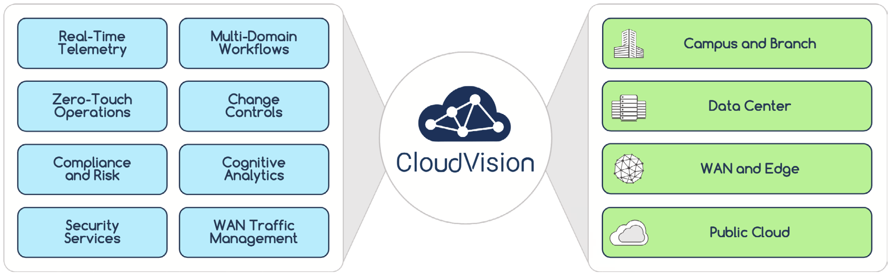

 

# Arista UpstateNY Region Newsletter

Welcome to the August 2025 newsletter for Arista customers in the U.S. Upstate NY Region!

 
We welcome your feedback on the newsletter. If you have any ideas on what you want to see, please reach out to [UpstateNY@arista.com](mailto:UpstateNY@arista.com)
 

---

## __*Upcoming Events*__  
Arista hosts various events throughout the year for you! Members of our team organize these informative events to showcase Arista's ability to not only help improve your network, but to also assist by providing a set of tools to improve your operations! Click on the boxes below to be directed to Arista's website for lists of Webinars and Events.

-   __Local Upstate NY Events__

    

    | Date         | Name                                     | Description                                                                                                                                                                                                                         | Location & Registration                                                                                       |
    |--------------|------------------------------------------|-------------------------------------------------------------------------------------------------------------------------------------------------------------------------------------------------------------------------------------|-------------------------------------------------------------------------------------------------------------|
    | __October 2__  | Next Gen Campus with Arista - WiFi & NAC Edition | Hands-on access to configure CV-CUE, CVaaS, AGNI, and your own AP. Deepen your understanding of Arista's Campus solutions.                                              | Canandaigua NY  [Register](https://events.arista.com/10-02-arista-campus-roadshow-canandaigua-ny){.register-link}                      |
    | __October 3__  | Next Gen Campus with Arista - WiFi & NAC Edition   | Hands-on access to configure CV-CUE, CVaaS, AGNI, and your own AP. Deepen your understanding of Arista's Campus solutions.                                                                    | Buffalo NY  [Register](https://events.arista.com/2025-10-03-arista-campus-roadshow-buffalo-ny){.register-link}  
    | __October 15__  | Build a Smarter Network (Local Gov) NEW  | Discover how New York towns and counties are modernizing networks to cut costs, simplify IT, and boost security.                                                                    | Webinar  [Register](https://arista.zoom.us/meeting/register/TnfmX2KfRQWiRgPMydXBRA#/registration){.register-link}                    |
    | __October 23__  | Arista Campus Networking Day   | Join us at Camp Arista where your guides will cover a range of technical topics and showcase innovative solutions.                                                                    | Syracuse NY  [Register](https://events.arista.com/2025-campus-networking-day-syracuse-ny){.register-link}                               |

-   __Global Webinars__  

    --- 

    We make it easy for you to view products that are of interest, all virtually! Technical members of the team showcase outstanding explanation of the products. Click below to see our list of Webinars. 

    [Arista Webinars](https://www.arista.com/en/company/news/webinars){.md-button}

-   __Global Events__ 

    ---
    Join us in person to get a closer look in our list of products and solution, as well as get the chance to meet members of the team. Click below to see our list of upcoming Events. 

    [Upcoming Events](https://www.arista.com/en/company/news/events){ .md-button }

--- 

## __*Software Updates*__

-   <!-- empty list item just to wrap the card content -->

    

    | **Software**     | **Version**                                        | **Release Date**                                    |
    |------------------|----------------------------------------------------|-----------------------------------------------------|
    | **EOS**          | 4.34.2F NEW  4.33.4M   4.32.6.1M   4.31.8M    | August 3rd, 2025   June 23th, 2025   July 2nd, 2025   June 23rd, 2025 |
    | **CVP**          | Portal 2025.2.0   Appliance 7.0.1   Sensor 1.1.1 NEW | July 2nd, 2025   January 28th, 2025   July 14th, 2025 |
    | **DMF**          | 8.8.0 NEW  8.7.2 NEW  8.6.2   8.5.3                                   | August 15th, 2025   July 25th, 2025   June 23rd, 2025   June 20th, 2025 |
    | **WLAN**         | CV-CUE 19.0.0-200   AP-19 19.0.0-183vv11 NEW   AP-18 18.0.0-183                              | June 13th, 2025   July 25th, 2025   March 27, 2025 |
    | **Arista NDR**   | 5.3.5                  | June 2025 |
    | **TerminAttr**   | 1.39.1 NEW                                            | July 18th, 2025 |
    | **VeloCloud**    | Orchestrator 6.4.0   Gateway 6.4.0   Edge 6.4.0 | May 2nd, 2025   May 2nd, 2025   May 2nd, 2025 |

    For all code releases, click [here](https://www.arista.com/en/support/software-download)

---

## __*Software Advisories*__

-   <!-- empty list item just to wrap the card content -->

    

    To view more details, click the advisory links below.

    | **Name** | **Advisory Link** | **Date** |
    |:--------:|:-----------------:|:--------:|
    | Encryption key configuration may be logged in clear text | [Advisory 0122](https://www.arista.com/en/support/advisories-notices/security-advisory/22022-security-advisory-0122) NEW | July 22, 2025 |
    | Maliciously formed UDP packets | [Advisory 0121](https://www.arista.com/en/support/advisories-notices/security-advisory/22021-security-advisory-0121) NEW | July 22, 2025 |
    | ACL policies may not be enforced | [Advisory 0120](https://www.arista.com/en/support/advisories-notices/security-advisory/21414-security-advisory-0120) | May 27, 2025 |
    | IPsec may exhibit unexpected behavior | [Advisory 0119](https://www.arista.com/en/support/advisories-notices/security-advisory/21413-security-advisory-0119) | May 27, 2025   Update: June 4, 2025 |
    | VLAN isolation and segmentation boundaries | [Advisory 0118](https://www.arista.com/en/support/advisories-notices/security-advisory/21411-security-advisory-0118) | May 20, 2025 |
    | Remote-server credentials | [Advisory 0117](https://www.arista.com/en/support/advisories-notices/security-advisory/21394-security-advisory-0117) | May 6, 2025   Update: May 20, 2025 |
    | Time Bound Device Onboarding | [Advisory 0116](https://www.arista.com/en/support/advisories-notices/security-advisory/21316-security-advisory-0116) | April 15, 2025 |
    | ZTP Admin Privileges | [Advisory 0115](https://www.arista.com/en/support/advisories-notices/security-advisory/21315-security-advisory-0115) | April 15, 2025 |
    | Malicious Authenticated User | [Advisory 0114](https://www.arista.com/en/support/advisories-notices/security-advisory/21314-security-advisory-0114) | April 15, 2025 |
    | EOS Secure VxLAN | [Advisory 0113](https://www.arista.com/en/support/advisories-notices/security-advisory/21289-security-advisory-0113) | April 8, 2025 |

    For a list of the most current advisories and notices, click [Here](https://www.arista.com/en/support/advisories-notices)

---

## __*Product Updates*__

- <!-- empty list item to wrap content -->

    

    **End of Sale** notices are listed below.

    <table>
      <thead>
        <tr>
          <th><b>Device</b></th>
          <th><b>Name</b></th>
          <th><b>End Of Sale Date</b></th>
        </tr>
      </thead>
      <tbody>
        <tr>
          <td>Software</td>
          <td>
            <a href="https://www.arista.com/en/support/advisories-notices/end-of-support/21089-end-of-software-support-for-7280r-r2-7500r-r2-and-7020r-series">EOS-4.34 and later no longer supported on select switches</a> 
            <a href="https://www.arista.com/en/support/advisories-notices/end-of-support/21094-end-of-support-for-dmf-and-ccf-deployments-on-accton-edgecore-switches">DMF and CCF Deployments on Accton/ Edgecore Switches</a> 
            <a href="https://www.arista.com/en/support/advisories-notices/end-of-support/21275-end-of-software-support-for-eos-4-28">End of Software Support for EOS 4.28</a> 
            <a href="https://www.arista.com/en/support/advisories-notices/end-of-support/21362-end-of-software-support-for-cloud-builder">CloudVision CloudBuilder 2025.1</a> 
            <a href="https://www.arista.com/en/support/advisories-notices/end-of-support/21417-end-of-software-support-for-dmf-8-3">DMF 8.3</a> 
            <a href="https://www.arista.com/en/support/advisories-notices/end-of-support/21627-end-of-software-support-for-cloudvision-portal-2023-3-release-train">CloudVision Portal 2023.3 Train</a> 
            <a href="https://www.arista.com/en/support/advisories-notices/end-of-sale/21653-end-of-sale-end-of-life-for-velocloud-software-defined-sd-access">VeloCloud Software Defined (SD) Access</a> 
            <a href="https://www.arista.com/en/support/advisories-notices/end-of-support/22004-end-of-software-support-for-cvp-ipam-application">CloudVision IPAM Application 2025.1</a> NEW 
          </td>
          <td>
            January 15, 2025 
            January 31, 2025 
            March 14, 2025 
            April 30, 2025 
            June 3, 2025 
            June 17, 2025 
            July 1, 2025 
            July 14, 2025
          </td>
        </tr>  
        <tr>
          <td>Module</td>
          <td><a href="https://www.arista.com/en/support/advisories-notices/end-of-sale/18886-end-of-sale-of-the-arista-7500r2-series-line-cards">7500R2 Series Linecards</a></td>
          <td>December 20, 2023</td>
        </tr>
        <tr>
          <td>Access Points</td>
          <td><a href="https://www.arista.com/en/support/advisories-notices/end-of-sale/20652-end-of-sale-of-ap-model-w-118">AP Model W-118</a></td>
          <td>November 20, 2024</td>
        </tr>
        <tr>
          <td>DMF</td>
          <td>
            <a href="https://www.arista.com/en/support/advisories-notices/end-of-sale/21087-end-of-sale-end-of-life-for-arista-recorder-node-appliance-dca-dm-ra3">Recorder Node DCA-DM-RA3</a> 
            <a href="https://www.arista.com/en/support/advisories-notices/end-of-sale/21416-end-of-sale-end-of-life-for-arista-recorder-node-appliance-dca-dm-sel">Service Node DCA-DM-SEL</a> 
            <a href="https://www.arista.com/en/support/advisories-notices/end-of-sale/21648-end-of-sale-end-of-life-for-arista-service-node-appliance-dca-dm-sdl">Service Node DCA-DM-SDL</a>
          </td>
          <td>
            January 14, 2025 
            June 3, 2025 
            July 1, 2025
          </td>
        </tr>
        <tr>
          <td>Switches</td>
          <td><a href="https://www.arista.com/en/support/advisories-notices/end-of-sale/21052-end-of-sale-of-the-arista-dcs-7020r-series">DCS-7020R Series</a></td>
          <td>December 20, 2024</td>
        </tr>
      </tbody>
    </table>

- <!-- empty list item to wrap content -->

    **New Releases** of Arista devices are listed below.

    <table>
      <thead>
        <tr>
          <th><b>Device</b></th>
          <th><b>More Information</b></th>
          <th><b>Release Date</b></th>
        </tr>
      </thead>
      <tbody>
        <tr>
          <td>Arista VeloCloud</td>
          <td><a href="https://www.arista.com/en/company/news/press-release/21646-pr-07012025">Expanded AI-Driven Campus and Branch Networking Offerings</a></td>
          <td>Q3 2025</td>
        </tr>
        <tr>
          <td>Arista Cluster Load Balancing (CLB)</td>
          <td><a href="https://www.arista.com/en/company/news/press-release/21271-pr-20250312">Intelligent Innovations for AI Networking</a></td>
          <td>Q2 2025</td>
        </tr>
        <tr>
          <td>The Ultra Ethernet Consortium</td>
          <td><a href="https://youtu.be/jfC-1u8BR4Y">A major milestone in redefining Ethernet for the AI and HPC</a></td>
          <td>Q2 2025</td>
        </tr>
        <tr>
          <td>Arista SWAG</td>
          <td><a href="https://www.arista.com/en/company/news/press-release/20693-pr-12032024">Modern Stacking for Campus</a></td>
          <td>Q1 2025</td>
        </tr>
      </tbody>
    </table>

---

## **Article #1 - A Commitment to Self-Improving Innovation**
By: Joe Mitri,  Senior Systems Engineer, Upstate NY Region

The other night I was walking through the grocery store. One of those late-night runs when the crowds are gone and the shelves are half empty. Passing the bakery, I saw it: one lonely, forgotten cupcake sitting on a tray like it had missed the party.

Then I noticed a rainbow of balloons swaying under the AC vents and had a sudden sinking feeling. Did I forget a birthday?

I pulled out my phone to check. Sure enough, I had. But in my defense, it never said a word. Not even a hint.

Somewhere between monitoring compliance and pushing configs, CloudVision quietly turned ten. And true to form, there was no drama, no fanfare, just a decade of being one of the most capable, feature-rich, and underrated platforms in networking.

So yes, this article is a belated birthday card. No balloons. But I did buy the cupcake 🧁.

In an industry where platforms are often discarded and reinvented every few years, CloudVision stands out as a rare example of evolution. A decade long commitment to self-improving innovation. More than just a management interface, it has become the foundation of operational simplicity and visibility across Arista deployments.

When CloudVision launched in 2015, it offered a single point of visibility for the entire network fabric. It was built on open standards and designed to scale. What is more impressive is how it has grown. Over the past decade, CloudVision has added live streaming telemetry, workflow automation, network auditability and compliance, campus-focused features, multi-domain security, AI-driven analytics, and much more. Not as bolt-ons or afterthoughts, but as integrated capabilities with a clear and consistent design vision that spans your entire Arista network.

<figure markdown>
{: style="height:200px;width:800px"} 
    <figcaption> Arista CloudVision </figcaption>
</figure>  

For ten years, CloudVision has helped customers move from their legacy architectures to a modern operating model. It has reduced operational costs, increased uptime, and improved security. From healthcare to education to finance, and everything in between, every enterprise can benefit from doing more with less.

I, for one, cannot wait to see what CloudVision does next.

If you would like to learn more, check out the YouTube link below or reach out to your local Arista team.

  <iframe src="https://www.youtube.com/embed/g5oYJk6-A60" style="position:absolute;top:0;left:0;width:100%;height:100%;" frameborder="0" allowfullscreen></iframe>

---

## **Article #2 - From Hyperscale to Hometown – Why the Town of Webster Trusts Arista** 
By: Jeramiah Pauly,  Associate Account Manager, Upstate NY Region

Arista, recently named one of Forbes’ Top 15 Best Companies in America for 2025, powers the backbone of global cloud giants like Microsoft and Meta. But some of our most meaningful success stories are unfolding much closer to home. One such example is in the Town of Webster, New York, where local government leaders turned to Arista to modernize their critical network infrastructure.

This month, we spoke with Steve Peace, Director of Information Technology, and John Camille, Network Administrator for the Town of Webster, to learn how Arista is reshaping their operations from the ground up. “Eye-opening. That’s the short version,” said Camille. “The longer version? Arista has completely changed how we think about and manage our network.”

Like many municipalities, Webster’s network had developed organically over time, with a patchwork of vendors and gear. That led to complexity, inconsistent configurations, and a reliance on workarounds instead of streamlined solutions. According to Camille, the change since deploying Arista has been dramatic. “Now, we can rack and configure a switch on-site and push configurations through CloudVision. What used to take days now takes hours.”

CloudVision, Arista’s management and analytics platform, has also revolutionized how Webster troubleshoots and plans their network. “The level of visibility and insight into client experience and network health is unmatched. We can show exactly where things are working and where they’re not. No guesswork, just facts.”

Camille highlighted the daily tools that have become essential to his team’s operations: dashboards, topology mapping, CVE and bug visibility, MAC address history, health monitoring, and configlet management—all within CloudVision. “Change management used to mean reading twenty pages of documentation, digging through forum threads, and deciphering handwritten notes,” he said. “Now, it’s one platform, one book, one design. It just works. Working with Arista makes everything easier—management, planning, implementation, and yes, even budgeting.”

From a leadership standpoint, the Town of Webster had clear goals: simplify network management, improve performance, and strengthen security. For Steve Peace, cost savings and long-term sustainability were critical factors in evaluating a new vendor. “We wanted to improve manageability, increase performance, eliminate vendor creep, and enhance our security posture by being able to easily install updates and fixes,” Peace explained. “We also needed a solution with the fewest CVEs in the market and at a lower cost. Arista checked every box.”

According to Peace, the decision to go with Arista didn’t take long. “The features, simplified licensing, and lower cost made it an easy decision. All switches operate on the same firmware, which makes updates and programming much easier.” Results came quickly. Security posture improved with modern hardware. CloudVision provided end-to-end visibility and control across every location. Configuration changes and software updates now roll out with speed and minimal disruption. “We’ve been very pleased with the devices and products installed so far,” Peace said. “I can’t wait to see the improvements once all our facilities are migrated to Arista.”

The Town of Webster’s journey reflects a growing trend across Upstate New York. Towns, counties, and public agencies are choosing Arista to simplify their networks, bolster security, and gain the agility to support evolving community needs. Whether managing large-scale cloud infrastructure or securing essential services for a local government, Arista delivers the same standard of reliability, visibility, and innovation.

What sets Arista apart?

- A single operating system across campus, data center, WAN, and branch
- Real-time streaming telemetry with AI-driven insights from CloudVision
- Orders of magnitude fewer bugs and security vulnerabilities than any competitor
- Industry-leading customer satisfaction and a Net Promoter Score of +87

For more information on how Arista can help modernize your network, contact Jeramiah Pauly at jpauly@arista.com

---
# *Feel Free to Reach Out To Us For Your Network Needs* 
<figure markdown>
{: style="height:300px;width:800px"}  
    <figcaption></figcaption>
</figure>
We thank you for taking the time to read our newsletter today. Feel free to reach out to your SE or ASE for more information or questions regarding your network operations. Until next month, have a good one! 