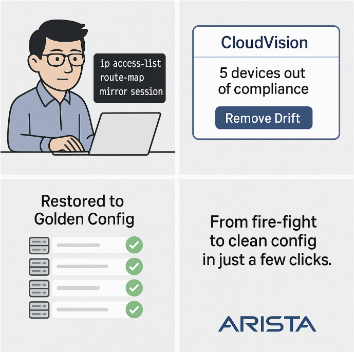

 

# Arista UpstateNY Region Newsletter

Welcome to the July 2025 newsletter for Arista customers in the U.S. Upstate NY Region!

 
We welcome your feedback on the newsletter. If you have any ideas on what you want to see, please reach out to [UpstateNY@arista.com](mailto:UpstateNY@arista.com)
 

---

## __*Upcoming Events*__  
Arista hosts various events throughout the year for you! Members of our team organize these informative events to showcase Arista's ability to not only help improve your network, but to also assist by providing a set of tools to improve your operations! Click on the boxes below to be directed to Arista's website for lists of Webinars and Events.

-   __Local Upstate NY Events__

    

    | Date         | Name                                     | Description                                                                                                                                                                                                                         | Location & Registration                                                                                       |
    |--------------|------------------------------------------|-------------------------------------------------------------------------------------------------------------------------------------------------------------------------------------------------------------------------------------|-------------------------------------------------------------------------------------------------------------|
    | __October 2__  | Arista AirLab - A hands-on WiFi workshop   | Hands-on access to configure CV-CUE, CVaaS, AGNI, and your own AP. Deepen your understanding of Arista's Campus solutions.                                              | Canandaigua NY  [Register](https://events.arista.com/10-02-arista-campus-roadshow-canandaigua-ny){.register-link}                      |
    | __October 3__  | Arista AirLab - A hands-on WiFi workshop     | Hands-on access to configure CV-CUE, CVaaS, AGNI, and your own AP. Deepen your understanding of Arista's Campus solutions.                                                                    | Buffalo NY  [Register](https://events.arista.com/2025-10-03-arista-campus-roadshow-buffalo-ny){.register-link}                    |
    | __October 21__  | Arista Campus Networking Day     | Join us at Camp Arista where your guides will cover a range of technical topics and showcase innovative solutions.                                                                    | Syracuse NY  [Register](https://events.arista.com/2025-campus-networking-day-syracuse-ny){.register-link}                               |

-   __Global Webinars__  

    --- 

    We make it easy for you to view products that are of interest, all virtually! Technical memebers of the team showcase outstanding explanation of the products. Click below to see our list of Webinars. 

    [Arista Webinars](https://www.arista.com/en/company/news/webinars){.md-button}

-   __Global Events__ 

    ---
    Join us in person to get a closer look in our list of products and solution, as well as get the chance to meet members of the team. Click below to see our list of upcoming Events. 

    [Upcoming Events](https://www.arista.com/en/company/news/events){ .md-button }

--- 

## __*Software Updates*__

-   <!-- empty list item just to wrap the card content -->

    

    | **Software**     | **Version**                                        | **Release Date**                                    |
    |-------------------|-----------------------------------------------------|-----------------------------------------------------|
    | **EOS**           | 4.34.1F   4.33.4M   4.32.6.1M   4.31.8M                | June 16th, 2025   June 23th, 2025   July 2nd, 2025   June 23rd, 2025|
    | **CVP**           | Portal 2025.2.0   Appliance 7.0.1   Sensor 1.1.0 | July 2nd, 2025   January 28th, 2025   March 20th, 2025 |
    | **DMF**           | 8.6.1   8.5.3                                     | March 4th, 2025   June 20th, 2025             |
    | **WLAN**          | CV-CUE 19.0.0  | June 13th, 2025        |
    | **Arista NDR**    | 5.3.5   AVA Sensor EOS-4.34.1F                                              | June 2025   June 2025                                        |
    | **TerminAttr**    | 1.38.2                                              | May 15th, 2025                                  |
    | **VeloCloud**           | Orchestrator 6.4.0   Gateway 6.4.0   Edge 6.4.0 | May 2nd, 2025   May 2nd, 2025   May 2nd, 2025 |

    For all code releases, click [here](https://www.arista.com/en/support/software-download)

---

## __*Software Advisories*__

-   <!-- empty list item just to wrap the card content -->

    

    To view more details, click the advisory links below.

    | **Name** | **Advisory Link** | **Date** |
    |:--------:|:-----------------:|:--------:|
    | ACL policies may not be enforced | [Advisory 0120](https://www.arista.com/en/support/advisories-notices/security-advisory/21414-security-advisory-0120) | May 27, 2025 |
    | IPsec may exhibit unexpected behavior | [Advisory 0119](https://www.arista.com/en/support/advisories-notices/security-advisory/21413-security-advisory-0119) | May 27, 2025   Update: June 4, 2025 |
    | VLAN isolation and segmentation boundaries | [Advisory 0118](https://www.arista.com/en/support/advisories-notices/security-advisory/21411-security-advisory-0118) | May 20, 2025 |
    | Remote-server credentials | [Advisory 0117](https://www.arista.com/en/support/advisories-notices/security-advisory/21394-security-advisory-0117) | May 6, 2025   Update: May 20, 2025 |
    | Time Bound Device Onboarding | [Advisory 0116](https://www.arista.com/en/support/advisories-notices/security-advisory/21316-security-advisory-0116) | April 15, 2025 |
    | ZTP Admin Privileges | [Advisory 0115](https://www.arista.com/en/support/advisories-notices/security-advisory/21315-security-advisory-0115) | April 15, 2025 |
    | Malicious Authenticated User | [Advisory 0114](https://www.arista.com/en/support/advisories-notices/security-advisory/21314-security-advisory-0114) | April 15, 2025 |
    | EOS Secure VxLAN | [Advisory 0113](https://www.arista.com/en/support/advisories-notices/security-advisory/21289-security-advisory-0113) | April 8, 2025 |

    For a list of the most current advisories and notices, click [Here](https://www.arista.com/en/support/advisories-notices)

---

## __*Product Updates*__

- <!-- empty list item to wrap content -->

    

    **End of Sale** notices are listed below.

    | **Device**      | **Name**                                                                                                                                                                                                                                                                                                                                                                                                                                                                                                                                                          | **End Of Sale Date**               |
    |-----------------|------------------------------------------------------------------------------------------------------------------------------------------------------------------------------------------------------------------------------------------------------------------------------------------------------------------------------------------------------------------------------------------------------------------------------------------------------------------------------------------------------------------------------------------------------------------|------------------------------------|
    | **Software**    | [End of Software Support for EOS 4.28](https://www.arista.com/en/support/advisories-notices/end-of-support/21275-end-of-software-support-for-eos-4-28) [DMF and CCF Deployments on Accton/ Edgecore Switches](https://www.arista.com/en/support/advisories-notices/end-of-support/21094-end-of-support-for-dmf-and-ccf-deployments-on-accton-edgecore-switches) [EOS-4.34 and later no longer supported on select switches](https://www.arista.com/en/support/advisories-notices/end-of-support/21089-end-of-software-support-for-7280r-r2-7500r-r2-and-7020r-series) [CloudVision Portal 2023.1 Train](https://www.arista.com/en/support/advisories-notices/end-of-support/21053-end-of-software-support-for-cloudvision-portal-2023-1-release-train) [VeloCloud Software Defined (SD) Access ](https://www.arista.com/en/support/advisories-notices/end-of-sale/21653-end-of-sale-end-of-life-for-velocloud-software-defined-sd-access) | March 14, 2025 January 31, 2025 January 15, 2025 December 20, 2024 July 1, 2025 |
    | **Module**      | [7500R2 Series Linecards](https://www.arista.com/en/support/advisories-notices/end-of-sale/18886-end-of-sale-of-the-arista-7500r2-series-line-cards)                                                                                                                                                                                                                                                                                                                                                                                                            | December 20, 2023                  |
    | **Access Points** | [AP Model W-118](https://www.arista.com/en/support/advisories-notices/end-of-sale/20652-end-of-sale-of-ap-model-w-118)                                                                                                                                                                                                                                                                                                                                                                                                                                          | November 20, 2024                  |
    | **DMF**         | [Recorder Node DCA-DM-RA3](https://www.arista.com/en/support/advisories-notices/end-of-sale/21087-end-of-sale-end-of-life-for-arista-recorder-node-appliance-dca-dm-ra3)   [Service Node DCA-DM-SEL](https://www.arista.com/en/support/advisories-notices/end-of-sale/21416-end-of-sale-end-of-life-for-arista-recorder-node-appliance-dca-dm-sel)   [Service Node DCA-DM-SDL](https://www.arista.com/en/support/advisories-notices/end-of-sale/21648-end-of-sale-end-of-life-for-arista-service-node-appliance-dca-dm-sdl)                                                                                                                                                                                                                                                                                                                                                                                          | January 14, 2025   June 3, 2025   July 1, 2025                   |
    | **Switches**    | [DCS-7020R Series](https://www.arista.com/en/support/advisories-notices/end-of-sale/21052-end-of-sale-of-the-arista-dcs-7020r-series)                                                                                                                                                                                                                                                                                                                                                                                                                            | December 20, 2024                  |

- <!-- empty list item to wrap content -->

    **New Releases** of Arista devices are listed below.

    | **Device**                        | **More Information**                                                                                                                   | **Release Date** |
    |----------------------------------|-----------------------------------------------------------------------------------------------------------------------------------------|------------------|
    | Arista VeloCloud                      | [Expanded AI-Driven Campus and Branch Networking Offerings](https://www.arista.com/en/company/news/press-release/21646-pr-07012025)                                   | Q3 2025          |
    | Arista Cluster Load Balancing (CLB)                      | [Intelligent Innovations for AI Networking](https://www.arista.com/en/company/news/press-release/21271-pr-20250312)                                   | Q2 2025          |
    | The Ultra Ethernet Consortium                      | [A major milestone in redefining Ethernet for the AI and HPC](https://youtu.be/jfC-1u8BR4Y)                                   | Q2 2025          |
    | Arista SWAG                      | [Modern Stacking for Campus](https://www.arista.com/en/company/news/press-release/20693-pr-12032024)                                   | Q1 2025          |

---

## **Article #1 - The Challenge of Configuration Drift in Network Troubleshooting**
By: Igor Parsadanov,  Team Lead Systems Engineering, Upstate NY Region

Picture this: there's a critical network issue, and you're called in to troubleshoot. Adrenaline's pumping, pressure's on. You jump into the CLI, hopping across devices, adding ACLs, tweaking route-maps, setting up mirror ports—whatever it takes to isolate the problem.

After a few hours, you prove what we all kind of knew: it's not the network. (Surprise, Surprise!)

But now you're left with a mess—temporary changes spread across five devices. Do you remember every tweak you made? You were careful not to break anything, but those changes weren't meant to stick around. If you forget them up, you've got config drift, and it ain't pretty. That's where CloudVision steps in.

It immediately flags those five devices as out of compliance with their golden configs. And the best part? With just a few clicks, you can wipe out the temporary changes and bring everything back to a clean, known-good state.

This is one of CloudVision's biggest strengths. It gives you full freedom to troubleshoot with CLI access, while silently tracking every change from the intended design. No scripts, no manual drifting, no headaches—just fast, reliable rollback when you're done.

CloudVision strikes the perfect balance between flexibility and control. You get real-time visibility across the entire network, and the peace of mind that comes with knowing you can always get back to baseline—quickly and safely.

Want to see it in action? Ask your Systems Engineer for a demo of configuration compliance with CloudVision.

---

## **Article #2 - Can gardening teach us a lesson in problem-solving: the difference between weeding a garden and merely cutting the weeds?** 
By: Mike Connally,  Professional Account Manager, Upstate NY Region

Summer in Upstate New York.  A welcome reprieve after the region's long precipitation season.  The phrase itself conjures recollection of the sun reflecting off lakes, lush mountains, long sun-drenched days and the aromatic flora surrounding us.  It's a time when nature bursts forth in growth and calls us to act on ambitious outdoor projects.  We are called to begin the constant effort of tending to our outdoor spaces.  Just like a flourishing garden, an enterprise network requires constant attention.

Imagine your garden. A persistent patch of dandelions has taken root, their bright yellow heads a cheerful but ultimately detrimental sight. You could, of course, easily snip off the heads.  For a brief time, the problem appears to be gone.  The garden looks tidier. This is the equivalent of fixing a problem on your network.  A switch port goes down; you reboot the switch.  A user complains of slow access; you restart their machine. These are quick, reactive measures that address the immediate symptoms. They offer a temporary reprieve, a superficial act masking a deeper issue.  The dandelions, you see, still have their roots firmly embedded, ready to sprout anew with the next rainfall.  What's worse, we frequently water our gardens in between rainfall encouraging weed growth at that same pace as our desirable growth.

Weeding, on the other hand, is a more deliberate and far more effective process.  It involves getting down on your hands and knees, understanding the plant's growth pattern, and carefully extracting the entire root system.  It's often messier, much more time-consuming, and requires a deeper understanding of the underlying biology.  Much like solving that persistent fundamental problem with your network.

Consider that slow application complaint, this time it’s from a corporate VIP.  Instead of a quick reboot, a "weeding" approach would involve delving into the network.  Is it a bandwidth issue?  A misconfigured QoS setting?  A rogue application monopolizing resources?  Are there aging, non-standard cables or faulty network cards that are consistently degrading performance?  Perhaps the network architecture itself, once perfectly adequate, is no longer scaling to meet the modern demands of today’s workforce or new cloud-based applications.   

Identifying the root cause requires a comprehensive view of the network path and its performance –  whether it's an inefficient proprietary feature / protocol, a tangle of software versions laced with their unique bugs, or a lack of proper network segmentation; you wouldn't know which root to pull without visibility across the entire packet path.  Demand for immediate relief may not afford you the time for systematically addressing it hence the giving in to clipping the weed.

Maintaining an enterprise LAN is not merely about reacting to outages or defending against the criticism.  It's about proactive care and willingness to acknowledge “problems that can be solved”.  Just as a gardener doesn't wait for their blooms to be overtaken by non-native plants before tending to them.  This involves continuous monitoring, performance baseline, regular security audits, and a commitment to understanding the evolving needs of the business. 

[Arista Networks' CloudVision Universal Network Observability (CV UNO)](https://www.arista.com/en/products/eos/eos-cloudvision/cv-uno) is a network observability solution that leverages DANZ Monitoring Fabric (DMF) for deeper insights into network and application performance. CV UNO uses machine learning and data analytics to provide proactive risk analysis, real-time impact analysis, and accelerated issue resolution. The DMF acts as a foundation for CV UNO, providing the infrastructure for capturing and filtering network traffic, while CV UNO analyzes this data to identify anomalies and performance issue

In the warmth of an Upstate New York summer, as the garden thrives under thoughtful cultivation, so too can your network flourish when its stewards adopt a "weeding" mindset. By consistently seeking out and eradicating the root causes of network architecture, devices and vulnerabilities, rather than just snipping at the symptoms, organizations can cultivate a culture of analysis and continuous improvement, where every "fix" is viewed as an opportunity to understand the underlying "weed" and actively prevent its recurrence.  The reward may well include network engineers who will enjoy more of the revitalizing seasonal activities this short season has to offer, and a business that delivers to its clients.

---
# *Feel Free to Reach Out To Us For Your Network Needs* 
<figure markdown>
{: style="height:300px;width:800px"}  
    <figcaption></figcaption>
</figure>
We thank you for taking the time to read our newsletter today. Feel free to reach out to your SE or ASE for more information or questions regardsing your network operations. Until next month, have a good one! 