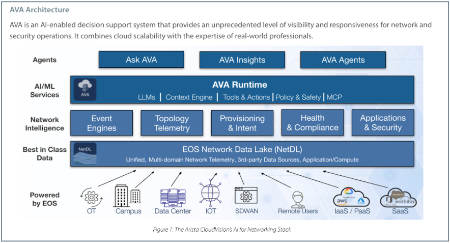
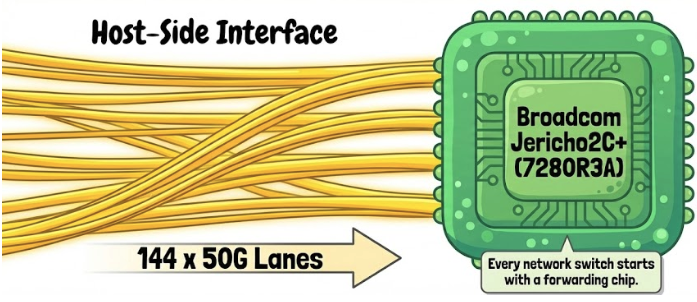
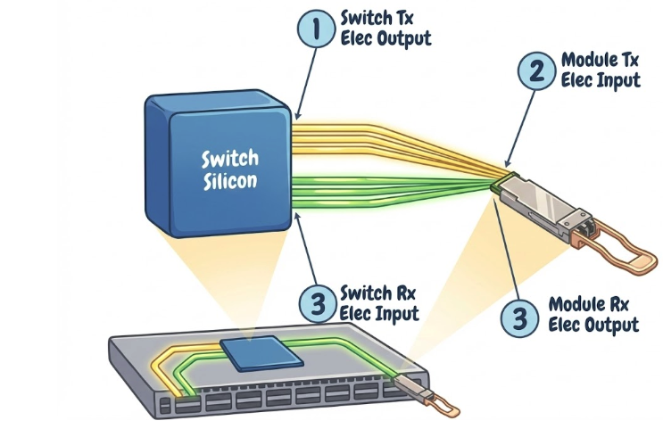
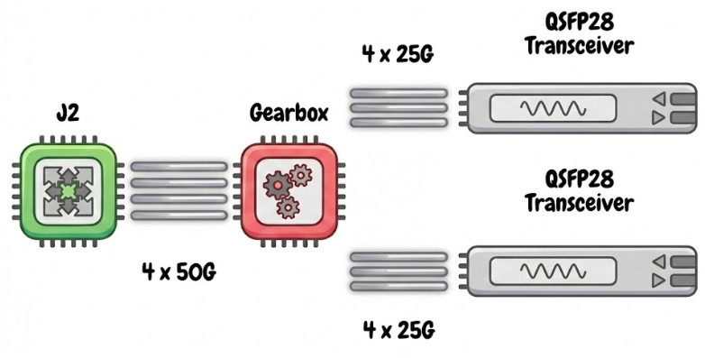

 

# Arista UpstateNY Region Newsletter

Welcome to the January 2026 newsletter for Arista customers in the U.S. Upstate NY Region!

 
We welcome your feedback on the newsletter. If you have any ideas on what you want to see, please reach out to [UpstateNY@arista.com](mailto:UpstateNY@arista.com)
 

---

## __*Upcoming Events*__ 🗓️
Arista hosts various events throughout the year for you! Members of our team organize these informative events to showcase Arista's ability to not only help improve your network, but to also assist by providing a set of tools to improve your operations! Click on the boxes below to be directed to Arista's website for lists of Webinars and Events.

-   __Local Upstate NY Events__

    

<figure markdown>
{: style="height:500px;width:800px"} 
    <figcaption>  </figcaption>
</figure>

-   __Global Webinars__  

    --- 

    We make it easy for you to view products that are of interest, all virtually! Technical members of the team showcase outstanding explanation of the products. Click below to see our list of Webinars. 

    [Arista Webinars](https://www.arista.com/en/company/news/webinars){.md-button}

-   __Global Events__ 

    ---
    Join us in person to get a closer look in our list of products and solution, as well as get the chance to meet members of the team. Click below to see our list of upcoming Events. 

    [Upcoming Events](https://www.arista.com/en/company/news/events){ .md-button }

--- 

## __*Software Updates*__ ⚙️

-   <!-- empty list item just to wrap the card content -->

    

    | **Software**     | **Version**                                        | **Release Date**                                    |
    |------------------|----------------------------------------------------|-----------------------------------------------------|
    | **EOS**          | 4.35.1F NEW   4.34.4M   4.33.6M   4.32.9M NEW   4.31.10M NEW   4.30.10M   | Dec 14th, 2025   Dec 1st, 2025   Nov 21st, 2025   Dec 29th, 2025   Dec 16th, 2025   April 18th, 2025 |
    | **CVP**          | Portal 2025.3.1 NEW    Appliance 7.1.0   Sensor 1.3.0 | Dec 15th, 2025   Sept 2nd, 2025   Dec 5th, 2025 |
    | **DMF**          | 8.8.0   8.7.2   8.6.2   8.5.3                                   | August 15th, 2025   July 25th, 2025   June 23rd, 2025   June 20th, 2025 |
    | **WLAN**         | CV-CUE 20.0.0-179   AP-21 21.1.0F-81   AP-20 20.0.0-183vv3    AP-19 19.0.0-183vv21                             | August 20th, 2025   Dec 4th, 2025   Sept 16th, 2025   Nov 13th, 2025  |
    | **Arista NDR**   | 5.3.5                  | June 2025 |
    | **TerminAttr**   | 1.41.3 NEW                                            | Dec 15th, 2025 |
    | **VeloCloud**    | Orchestrator 6.4.1   Gateway 6.4.1   Edge 6.4.1 | Oct 2025   Nov 26th, 2025   Nov 26th, 2025 |

    For all code releases, click [here](https://www.arista.com/en/support/software-download)

---

## __*Software Advisories*__ 🚨

-   <!-- empty list item just to wrap the card content -->

    

    To view more details, click the advisory links below.

    | **Name** | **Advisory Link** | **Date** |
    |:--------:|:-----------------:|:--------:|
    | MACsec | [Advisory 0132](https://www.arista.com/en/support/advisories-notices/security-advisory/23120-security-advisory-0132) NEW  | Dec 30th, 2025 |
    | SQL / VeloCloud | [Advisory 0131](https://www.arista.com/en/support/advisories-notices/security-advisory/23119-security-advisory-0131) NEW  | Dec 23rd, 2025 |
    | Disclosure / VeloCloud | [Advisory 0130](https://www.arista.com/en/support/advisories-notices/security-advisory/23118-security-advisory-0130) NEW | Dec 23rd, 2025  |
    | VMware / VeloCloud | [Advisory 0129](https://www.arista.com/en/support/advisories-notices/security-advisory/23117-security-advisory-0129) NEW  | Dec 23rd, 2025 |
    | OSPFv3 | [Advisory 0128](https://www.arista.com/en/support/advisories-notices/security-advisory/23115-security-advisory-0128) NEW  | Dec 16th, 2025  |

    For a list of the most current advisories and notices, click [Here](https://www.arista.com/en/support/advisories-notices)

---

## __*Product Updates*__  🏷️

- <!-- empty list item to wrap content -->

    

    **End of Sale** notices are listed below.  
    **Field Notices** NOT related to End of Sale can be found [here](https://www.arista.com/en/support/advisories-notices/fieldnotice)  

    <table>
      <thead>
        <tr>
          <th><b>Device</b></th>
          <th><b>Name</b></th>
          <th><b>End Of Sale Date</b></th>
        </tr>
      </thead>
      <tbody>
        <tr>
          <td>Software</td>
          <td>
            <a href="https://www.arista.com/en/support/advisories-notices/end-of-sale/22430-end-of-sale-end-of-life-for-arista-ccf-product-line">CCF Product Line</a>   
            <a href="https://www.arista.com/en/support/advisories-notices/end-of-support/22431-end-of-software-support-for-cloudvision-portal-2024-1-release-train">CloudVision Portal 2024.1</a>   
          </td>
          <td>
            Oct 1, 2025 
            Oct 2, 2025
          </td>
        </tr>  
        <tr>
          <td>Module</td>
          <td><a href="https://www.arista.com/en/support/advisories-notices/end-of-sale/18886-end-of-sale-of-the-arista-7500r2-series-line-cards">7500R2 Series Linecards</a></td>
          <td>December 20, 2023</td>
        </tr>
        <tr>
          <td>Access Points</td>
          <td>
            <a href="https://www.arista.com/en/support/advisories-notices/end-of-sale/22536-end-of-sale-of-ap-mounts-mnt-ap-flat-c130-mnt-ap-flat-c100-mnt-ap-flat-14cm-a">MNT-AP-FLAT-C130/C100/14CM-A</a> 
          </td>  
          <td>
            October 22, 2025
          </td>  
        </tr>
        <tr>
          <td>DMF</td>
          <td>
            <a href="https://www.arista.com/en/support/advisories-notices/end-of-sale/22537-end-of-sale-end-of-life-for-arista-service-node-appliance-dca-dm-sc2">Service Node DCA-DM-SC2</a> 
          </td>
          <td>
            October 22, 2025
          </td>
        </tr>
        <tr>
          <td>Switches</td>
          <td>
            <a href="https://www.arista.com/en/support/advisories-notices/end-of-sale/21052-end-of-sale-of-the-arista-dcs-7020r-series">DCS-7020R Series</a> 
          </td>
          <td>
            December 20, 2025
          </td>
        </tr>
        <tr>          
          <td>VeloCloud</td>
          <td>
            <a href="https://www.arista.com/en/support/advisories-notices/end-of-sale/22556-end-of-sale-of-the-arista-edge-threat-management-micro-edge-q6e-and-q6ewl-series">Micro Edge Q6E and Q6EWL Series</a> 
          </td>
          <td>
            November 5, 2025
          </td>          
      </tbody>
    </table>

- <!-- empty list item to wrap content -->

    **New 2026 Releases** of Arista products are listed below.

    <table>
      <thead>
        <tr>
          <th><b>Device</b></th>
          <th><b>More Information</b></th>
          <th><b>Release Date</b></th>
        </tr>
      </thead>
      <tbody>
        <tr>
          <td>Arista Introduces Massive Scale Campus Mobility NEW</td> 
          <td><a href="https://www.arista.com/en/company/news/press-release/22998-pr-20251210">Powered by Arista VESPA and expanded AVA for operational excellence
</a></td>
          <td>Q1 2026</td>
      </tbody>
    </table>

---

## **Spotlight** 🔦 

<strong>Solving Large Scale Campus Mobility with Arista VESPA</strong> 

  <iframe src="https://www.youtube.com/embed/FUriyTCSmUU" style="position:absolute;top:0;left:0;width:100%;height:100%;" frameborder="0" allowfullscreen></iframe>

 
 

<strong>Take a look at New 800G R4 series portfolio!</strong> 

  <iframe src="https://www.youtube-nocookie.com/embed/1DAlLYqxj44?rel=0&modestbranding=1" style="position:absolute;top:0;left:0;width:100%;height:100%;" frameborder="0" allowfullscreen></iframe>

 
 

<strong>Take a look at these Arista testimonials from an A-List of A.I. industry luminaries!</strong> 

  <iframe src="https://www.youtube.com/embed/FzwydqLKHxI?rel=0&wmode=transparent" style="position:absolute;top:0;left:0;width:100%;height:100%;" frameborder="0" allowfullscreen></iframe>

---

## **Article #1 - AI for Networking Has Entered Its Next Chapter** 
By: Jeramiah Pauly, Associate Account Manager - Upstate NY Region

  Meet Arista AVA

As we head into the new year, many of the conversations I am having across Upstate New York sound the same.

- Networks are more critical than ever.
- Teams are leaner than ever.
- And complexity keeps creeping up.

That is exactly why I am excited to share what Arista has been building behind the scenes. Arista AVA: AI for Networking.

AVA is not a bolt on feature or another dashboard. It represents a fundamental shift in how networks can be operated, understood, and improved over time.

“*What’s exciting is the shift from static dashboards to an AI agent that understands network state. Operators can now communicate with their data, gain a 360-degree view of the infrastructure, and collaborate with the NOC to troubleshoot issues or plan new deployments. This represents a major step forward not just for Arista, but for the networking industry as a whole.*” - [Nick Lippis](https://www.youtube.com/watch?v=h2zMyqwUMF0), Founder of ONUG

  What AVA Actually Is

AVA stands for Autonomous Virtual Assistant, and that distinction matters.

AVA is not just another large language model answering questions based on public information or generic training data. It is a true assistant that understands the unique context of your environment.

AVA knows your network. Every device. Every configuration. Every dependency. Every event.

Instead of searching the internet for possible explanations, AVA reasons directly from the live and historical data of your infrastructure. That is what allows it to deliver answers that are relevant, accurate, and actionable.

<figure markdown>
{: style="height:375px;width:800px"} 
    <figcaption>  </figcaption>
</figure>

  From Reactive Operations to Autonomous Intelligence

AVA delivers a truly unified agentic AI framework for networking, establishing the foundation for autonomous, self-driving networks.

What does that actually mean in practice?

Instead of reacting to alerts after users complain, AVA continuously monitors the environment, understands context across the entire network, and proactively identifies issues before they become outages. This dramatically simplifies day to day operations and transforms AIOps from a buzzword into something that actually helps engineers do their jobs better.

  Built on EOS. Powered by Real Data.

AVA is powered by Arista EOS, which provides the open and programmable interface AI agents need to interact directly with the network in a meaningful way.

At the center of it all is NetDL, Arista’s comprehensive data lake. NetDL aggregates all relevant network and operational data, including telemetry from wired, wireless, data center, security, and even third party systems.

The result is a single source of truth, not fragmented views or siloed tools.

This unified data foundation gives AVA the full context it needs to reason, correlate, and act intelligently across the entire infrastructure.

  Open by Design. Ready for the Future.

One of the most important aspects of AVA is openness.

Through support for Model Context Protocol, AVA allows AI agents from Arista or trusted third parties to securely access the same shared context. This means customers are not locked into a closed system, and innovation can extend well beyond a single vendor.

It is a future proof approach that aligns perfectly with how modern IT teams want to operate.

  What AVA Enables Today

With this foundation in place, AVA unlocks powerful new capabilities, including:

- Multi domain event correlation
    - AVA correlates events across wired, wireless, data center, and security domains to identify a single root cause instead of flooding teams with noise.
- Ask AVA conversational troubleshooting
    - Engineers can interact with the network using natural, multi-turn conversations that follow their train of thought, dramatically reducing time to resolution.
- Continuous monitoring and automated root cause analysis
    - Issues are identified proactively, with clear explanations of what happened, why it happened, and what to do next.

  Why This Matters for Upstate NY Organizations

Whether you are supporting a school district, hospital, manufacturer, municipality, or enterprise campus, the challenges are the same. Limited staff, growing expectations, and no tolerance for downtime.

AVA was built to meet those realities head on. It was designed to help you move toward a network that is not just faster or bigger, but smarter, simpler, and easier to operate.

AVA is not searching the web for answers. It is learning from your network and working alongside your team.

Let’s see how AVA supercharges your environment.

Read more about Arista Networks [AVA](https://www.arista.com/assets/data/pdf/Whitepapers/Arista-AVA-Whitepaper.pdf) and [(AI) networking solutions](https://www.arista.com/en/solutions/ai-networking).

---

## **Article #2 - What is a SerDes?**
By: Ryan Clark, Systems Engineer, Upstate NY Region

When I first started working at Arista, I gained access to great minds in the field of layer-1 networking. If you think protocol acronyms are hard to keep track of - good luck in the hardware space…

One term I kept hearing over and over was **SerDes** (pronounced SIR-deez, rhymes with “birdies”). I kept thinking *“What the heck is this SerDes thing everyone keeps mentioning?”* 

Well, I am here to break it down for you. Thankfully timely due to Jeramiah’s article on AI (Artical #1). 

  The Highway

Every network switch starts with a forwarding chip. For us, it’s typically manufactured by Broadcom. Each generation of these chips accepts an [encoded](https://www.keysight.com/blogs/en/inds/ai/pam4-pulse-amplitude-modulation-explained) **electrical signal** (1’s and 0’s) at a specific **speed** or **set of speeds**. 

Jericho2C+ (your 7280R3A) for example has 144 x 50G “lanes”. Think of these lanes as **lanes** on a highway and the **speed** is the MPH limit. Newer generations of switch silicon either increases the lanes or the MPH limit. This is commonly called the “**host-side**”.  

<figure markdown>
{: style="height:350px;width:800px"} 
    <figcaption>  </figcaption>
</figure>

Some of these lanes are assigned to **front-panel ports** and some to **fabric ports**. The fabric ports internally stitch each front-panel port together so traffic can flow from one interface to another (green and yellow lines below). 

<figure markdown>
{: style="height:425px;width:800px"} 
    <figcaption>  </figcaption>
</figure>

  The Traffic Cops

Ok Ryan, I have a 7280CR3A-32S, but the interfaces I plug into are 100G, how does a chip with 50G SerDes do this? This is done with a **gearbox.** 

In the scope of this discussion, gearboxes provide **rate conversion**. In our example, the switch has two sets of gearboxes. One set converts (56) 50G SerDes **lanes** into (28) 100G front panel ports and another (16) 50G **lanes** into (4) 100G, (2) 200G or (1) 400G port. There is a lot more to it - but let's leave it there 😅. 

<figure markdown>
{: style="height:375px;width:800px"} 
    <figcaption>  </figcaption>
</figure>

  The Offramps

We have now converted **electrical lanes** into a speed a transceiver can understand. We now need to chuck this signal from the traces (wires on the circuit board) inside the switch to a **transceiver** or **copper** cable. This is done with a **PHY**. A PHY handles the conversion and encoding necessary so the device on the other end can communicate with us ([1](https://www.arista.com/en/um-eos/eos-ethernet-ports#:~:text=The%20PHY%20provides%20translation%20services%20between%20the%20MAC%20layer%20and%20the%20transceiver)). 

The laser diode inside the transceiver converts the electrical signal into an optical signal or we carry the electrical signal over a copper cable - we commonly call that the “**line-side**”. And off we go!!

<figure markdown>
{: style="height:150px;width:800px"} 
    <figcaption>  </figcaption>
</figure>

How does this relate to AI? Well, the Jericho3-AI chip in our new [7700R4 and 7800R4](https://www.arista.com/en/company/news/press-release/19493-arista-unveils-etherlink-ai-networking-platforms) switches has (**304**) **100G** SerDes for a total of **30Tb/s+** - from *one chip* (14.5 Tb/s line-side I/O). With a fully loaded 7800R4 supporting up to **460Tb/s** 🤯!!

---
# *Feel Free to Reach Out To Us For Your Network Needs* 
<figure markdown>
{: style="height:300px;width:800px"}  
    <figcaption></figcaption>
</figure>
We thank you for taking the time to read our newsletter today. Feel free to reach out to your SE or ASE for more information or questions regarding your network operations. Until next month, have a good one! 