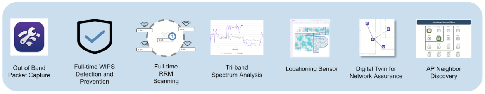

 

# Arista UpstateNY Region Newsletter

Welcome to the August 2025 newsletter for Arista customers in the U.S. Upstate NY Region!

 
We welcome your feedback on the newsletter. If you have any ideas on what you want to see, please reach out to [UpstateNY@arista.com](mailto:UpstateNY@arista.com)
 

---

## __*Upcoming Events*__  
Arista hosts various events throughout the year for you! Members of our team organize these informative events to showcase Arista's ability to not only help improve your network, but to also assist by providing a set of tools to improve your operations! Click on the boxes below to be directed to Arista's website for lists of Webinars and Events.

-   __Local Upstate NY Events__

    

    | Date         | Name                                     | Description                                                                                                                                                                                                                         | Location & Registration                                                                                       |
    |--------------|------------------------------------------|-------------------------------------------------------------------------------------------------------------------------------------------------------------------------------------------------------------------------------------|-------------------------------------------------------------------------------------------------------------|
    | __October 1__  | Arista Test Drive NEW | Interested in learning why Arista Networks is the preferred choice for data centers? Join us for a no-cost, hands-on training session led by local Arista engineers                                             | Poughkeepsie&nbsp;NY  [Register](https://events.arista.com/2025-10-01-arista-test-drive-poughkeepsie-ny){.register-link}      
    | __October 2__  | Next Gen Campus with Arista - WiFi & NAC Edition | Hands-on access to configure CV-CUE, CVaaS, AGNI, and your own AP. Deepen your understanding of Arista's Campus solutions.                                              | Canandaigua NY  [Register](https://events.arista.com/10-02-arista-campus-roadshow-canandaigua-ny){.register-link}                      |
    | __October 3__  | Next Gen Campus with Arista - WiFi & NAC Edition   | Hands-on access to configure CV-CUE, CVaaS, AGNI, and your own AP. Deepen your understanding of Arista's Campus solutions.                                                                    | Buffalo NY  [Register](https://events.arista.com/2025-10-03-arista-campus-roadshow-buffalo-ny){.register-link}  
    | __October 15__  | Build a Smarter Network (Local Gov) | Discover how New York towns and counties are modernizing networks to cut costs, simplify IT, and boost security.                                                                    | Webinar  [Register](https://arista.zoom.us/meeting/register/TnfmX2KfRQWiRgPMydXBRA#/registration){.register-link}                    |
    | __October 23__  | Arista Campus Networking Day   | Join us at Camp Arista where your guides will cover a range of technical topics and showcase innovative solutions.                                                                    | Syracuse NY  [Register](https://events.arista.com/2025-campus-networking-day-syracuse-ny){.register-link}                               |

-   __Global Webinars__  

    --- 

    We make it easy for you to view products that are of interest, all virtually! Technical members of the team showcase outstanding explanation of the products. Click below to see our list of Webinars. 

    [Arista Webinars](https://www.arista.com/en/company/news/webinars){.md-button}

-   __Global Events__ 

    ---
    Join us in person to get a closer look in our list of products and solution, as well as get the chance to meet members of the team. Click below to see our list of upcoming Events. 

    [Upcoming Events](https://www.arista.com/en/company/news/events){ .md-button }

--- 

## __*Software Updates*__

-   <!-- empty list item just to wrap the card content -->

    

    | **Software**     | **Version**                                        | **Release Date**                                    |
    |------------------|----------------------------------------------------|-----------------------------------------------------|
    | **EOS**          | 4.34.2F   4.33.5M NEW   4.32.7M NEW   4.31.9M NEW   | August 3rd, 2025   Sept 3rd, 2025   Sept 4th, 2025   Sept 4th, 2025 |
    | **CVP**          | Portal 2025.1.3 NEW   Appliance 7.0.1   Sensor 1.2.0 NEW | Sept 4th, 2025   January 28th, 2025   Sept 4th, 2025 |
    | **DMF**          | 8.8.0   8.7.2   8.6.2   8.5.3                                   | August 15th, 2025   July 25th, 2025   June 23rd, 2025   June 20th, 2025 |
    | **WLAN**         | CV-CUE 20.0.0-179 NEW   AP-20 20.0.0-179 NEW   AP-19 19.0.0-183vv11                             | August 20th, 2025   August 20th, 2025   July 25th, 2025 |
    | **Arista NDR**   | 5.3.5                  | June 2025 |
    | **TerminAttr**   | 1.40.0 NEW                                            | Sept 4th, 2025 |
    | **VeloCloud**    | Orchestrator 6.4.0   Gateway 6.4.0   Edge 6.4.0 | May 2nd, 2025   May 2nd, 2025   May 2nd, 2025 |

    For all code releases, click [here](https://www.arista.com/en/support/software-download)

---

## __*Software Advisories*__

-   <!-- empty list item just to wrap the card content -->

    

    To view more details, click the advisory links below.

    | **Name** | **Advisory Link** | **Date** |
    |:--------:|:-----------------:|:--------:|
    | Encryption key configuration may be logged in clear text | [Advisory 0122](https://www.arista.com/en/support/advisories-notices/security-advisory/22022-security-advisory-0122) | July 22, 2025 |
    | Maliciously formed UDP packets | [Advisory 0121](https://www.arista.com/en/support/advisories-notices/security-advisory/22021-security-advisory-0121) | July 22, 2025 |
    | ACL policies may not be enforced | [Advisory 0120](https://www.arista.com/en/support/advisories-notices/security-advisory/21414-security-advisory-0120) | May 27, 2025 |
    | IPsec may exhibit unexpected behavior | [Advisory 0119](https://www.arista.com/en/support/advisories-notices/security-advisory/21413-security-advisory-0119) | May 27, 2025   Update: June 4, 2025 |
    | VLAN isolation and segmentation boundaries | [Advisory 0118](https://www.arista.com/en/support/advisories-notices/security-advisory/21411-security-advisory-0118) | May 20, 2025 |
    | Remote-server credentials | [Advisory 0117](https://www.arista.com/en/support/advisories-notices/security-advisory/21394-security-advisory-0117) | May 6, 2025   Update: May 20, 2025 |
    | Time Bound Device Onboarding | [Advisory 0116](https://www.arista.com/en/support/advisories-notices/security-advisory/21316-security-advisory-0116) | April 15, 2025 |
    | ZTP Admin Privileges | [Advisory 0115](https://www.arista.com/en/support/advisories-notices/security-advisory/21315-security-advisory-0115) | April 15, 2025 |
    | Malicious Authenticated User | [Advisory 0114](https://www.arista.com/en/support/advisories-notices/security-advisory/21314-security-advisory-0114) | April 15, 2025 |
    | EOS Secure VxLAN | [Advisory 0113](https://www.arista.com/en/support/advisories-notices/security-advisory/21289-security-advisory-0113) | April 8, 2025 |

    For a list of the most current advisories and notices, click [Here](https://www.arista.com/en/support/advisories-notices)

---

## __*Product Updates*__

- <!-- empty list item to wrap content -->

    

    **End of Sale** notices are listed below.

    <table>
      <thead>
        <tr>
          <th><b>Device</b></th>
          <th><b>Name</b></th>
          <th><b>End Of Sale Date</b></th>
        </tr>
      </thead>
      <tbody>
        <tr>
          <td>Software</td>
          <td>
            <a href="https://www.arista.com/en/support/advisories-notices/end-of-support/21089-end-of-software-support-for-7280r-r2-7500r-r2-and-7020r-series">EOS-4.34 and later no longer supported on select switches</a> 
            <a href="https://www.arista.com/en/support/advisories-notices/end-of-support/21094-end-of-support-for-dmf-and-ccf-deployments-on-accton-edgecore-switches">DMF and CCF Deployments on Accton/ Edgecore Switches</a> 
            <a href="https://www.arista.com/en/support/advisories-notices/end-of-support/21275-end-of-software-support-for-eos-4-28">End of Software Support for EOS 4.28</a> 
            <a href="https://www.arista.com/en/support/advisories-notices/end-of-support/21362-end-of-software-support-for-cloud-builder">CloudVision CloudBuilder 2025.1</a> 
            <a href="https://www.arista.com/en/support/advisories-notices/end-of-support/21417-end-of-software-support-for-dmf-8-3">DMF 8.3</a> 
            <a href="https://www.arista.com/en/support/advisories-notices/end-of-support/21627-end-of-software-support-for-cloudvision-portal-2023-3-release-train">CloudVision Portal 2023.3 Train</a> 
            <a href="https://www.arista.com/en/support/advisories-notices/end-of-sale/21653-end-of-sale-end-of-life-for-velocloud-software-defined-sd-access">VeloCloud Software Defined (SD) Access</a> 
            <a href="https://www.arista.com/en/support/advisories-notices/end-of-sale/22072-end-of-sale-life-velocloud-sase-secured-symantec">VeloCloud SASE Secured by Symantec</a>  
            <a href="https://www.arista.com/en/support/advisories-notices/end-of-support/22004-end-of-software-support-for-cvp-ipam-application">CloudVision IPAM Application 2025.1</a>  
            <a href="https://www.arista.com/en/support/advisories-notices/field-notice/22238-field-notice-0111">CloudVision Portal 2025.2.1</a> NEW  
            <a href="https://www.arista.com/en/support/advisories-notices/field-notice/22238-field-notice-0111">CloudVision Portal 2025.2.0</a> NEW  
            <a href="https://www.arista.com/en/support/advisories-notices/field-notice/22237-field-notice-0110">CloudVision Portal 2025.1.2</a> NEW  
          </td>
          <td>
            January 15, 2025 
            January 31, 2025 
            March 14, 2025 
            April 30, 2025 
            June 3, 2025 
            June 17, 2025 
            July 1, 2025 
            July 1, 2025 
            July 14, 2025 
            Sept 3, 2025 
            Sept 3, 2025 
            Sept 4, 2025
          </td>
        </tr>  
        <tr>
          <td>Module</td>
          <td><a href="https://www.arista.com/en/support/advisories-notices/end-of-sale/18886-end-of-sale-of-the-arista-7500r2-series-line-cards">7500R2 Series Linecards</a></td>
          <td>December 20, 2023</td>
        </tr>
        <tr>
          <td>Access Points</td>
          <td><a href="https://www.arista.com/en/support/advisories-notices/end-of-sale/20652-end-of-sale-of-ap-model-w-118">AP Model W-118</a></td>
          <td>November 20, 2024</td>
        </tr>
        <tr>
          <td>DMF</td>
          <td>
            <a href="https://www.arista.com/en/support/advisories-notices/end-of-sale/21087-end-of-sale-end-of-life-for-arista-recorder-node-appliance-dca-dm-ra3">Recorder Node DCA-DM-RA3</a> 
            <a href="https://www.arista.com/en/support/advisories-notices/end-of-sale/21416-end-of-sale-end-of-life-for-arista-recorder-node-appliance-dca-dm-sel">Service Node DCA-DM-SEL</a> 
            <a href="https://www.arista.com/en/support/advisories-notices/end-of-sale/21648-end-of-sale-end-of-life-for-arista-service-node-appliance-dca-dm-sdl">Service Node DCA-DM-SDL</a>
          </td>
          <td>
            January 14, 2025 
            June 3, 2025 
            July 1, 2025
          </td>
        </tr>
        <tr>
          <td>Switches</td>
          <td>
            <a href="https://www.arista.com/en/support/advisories-notices/end-of-sale/21052-end-of-sale-of-the-arista-dcs-7020r-series">DCS-7020R Series</a> 
            <a href="https://www.arista.com/en/support/advisories-notices/end-of-sale/22401-end-of-sale-of-the-arista-ccs-710p-12-switch">CCS-710P-12</a> NEW 
            <a href="https://www.arista.com/en/support/advisories-notices/end-of-sale/22402-end-of-sale-of-the-arista-ccs-720d-switches-with-4gb-dram">CCS-720DP-24S</a> NEW 
            <a href="https://www.arista.com/en/support/advisories-notices/end-of-sale/22402-end-of-sale-of-the-arista-ccs-720d-switches-with-4gb-dram">CCS-720DP-48S</a> NEW 
            <a href="https://www.arista.com/en/support/advisories-notices/end-of-sale/22402-end-of-sale-of-the-arista-ccs-720d-switches-with-4gb-dram">CCS-720DT-24S</a> NEW 
            <a href="https://www.arista.com/en/support/advisories-notices/end-of-sale/22402-end-of-sale-of-the-arista-ccs-720d-switches-with-4gb-dram">CCS-720DF-48Y</a> NEW 
            <a href="https://www.arista.com/en/support/advisories-notices/end-of-sale/22403-end-of-sale-of-the-arista-ccs-720xp-96zc2-switches-with-4gb-dram">CCS-720XP-96ZC2</a> NEW
          </td>
          <td>
            December 20, 2025 
            September 12, 2025 
            September 12, 2025 
            September 12, 2025 
            September 12, 2025 
            September 12, 2025 
            September 12, 2025
          </td>
      </tbody>
    </table>

- <!-- empty list item to wrap content -->

    **New Releases** of Arista devices are listed below.

    <table>
      <thead>
        <tr>
          <th><b>Device</b></th>
          <th><b>More Information</b></th>
          <th><b>Release Date</b></th>
        </tr>
      </thead>
      <tbody>
        <tr>
          <td>Arista VeloCloud</td>
          <td><a href="https://www.arista.com/en/company/news/press-release/21646-pr-07012025">Expanded AI-Driven Campus and Branch Networking Offerings</a></td>
          <td>Q3 2025</td>
        </tr>
        <tr>
          <td>Arista Cluster Load Balancing (CLB)</td>
          <td><a href="https://www.arista.com/en/company/news/press-release/21271-pr-20250312">Intelligent Innovations for AI Networking</a></td>
          <td>Q2 2025</td>
        </tr>
        <tr>
          <td>The Ultra Ethernet Consortium</td>
          <td><a href="https://youtu.be/jfC-1u8BR4Y">A major milestone in redefining Ethernet for the AI and HPC</a></td>
          <td>Q2 2025</td>
        </tr>
        <tr>
          <td>Arista SWAG</td>
          <td><a href="https://www.arista.com/en/company/news/press-release/20693-pr-12032024">Modern Stacking for Campus</a></td>
          <td>Q1 2025</td>
        </tr>
      </tbody>
    </table>

---

## __*SPOTLIGHT A.I.*__ 

<strong>Take a look at these Arista testimonials from an A-List of A.I. industry luminaries!</strong> NEW

  <iframe src="https://www.youtube.com/embed/FzwydqLKHxI?rel=0&wmode=transparent" style="position:absolute;top:0;left:0;width:100%;height:100%;" frameborder="0" allowfullscreen></iframe>

---

## **Article #1 - Is Your Wi-Fi Working Overtime?**
By: Jacob Darling,  Systems Engineer, Upstate NY Region

As engineers, we strive to give our wireless clients the best signal, the best throughput, and the most reliable airtime. The airwaves are continuously saturated with everything from neighboring rogue Wi-Fi networks to microwaves in the break room heating your co-workers' lunch. The last thing we want to interrupt are the valuable radio cycles dedicated to any given user device. In order to adapt to a real time RF environment, access points have historically consumed bits of those client cycles to successfully channel plan, power plan, and avoid inevitable interference. 

**But what if we didn’t have to live in that world any longer?**

I’d like to take a moment to highlight the Multifunction Radio present in many of Arista Networks access points. A dedicated Tri-Band radio that is capable of giving those client radio cycles back to the clients! A true swiss army knife of the wireless world. Not only does this radio take over the burden of traditional client radio background scanning, it offers a breadth of tools to add to your engineers toolbelt. A few of my favorites include:

- The ability to turn this radio **into a client!** Gain real time network insights for a specific location and simulate day-to-day traffic activities. These include simple throughput testing, VoIP calling tests, or even simulating reachability to your custom applications. Run these tests against neighboring APs before ever stepping foot onsite.

- Always available **Spectrum Analysis** - Stop spending your wi-fi budget on additional standalone spectrum sensors!

- Over-The-Air **Packet Captures** - Get a deeper analysis of your environment by capturing Management, Data and Control Frames from an AP and surrounding APs.

These are all very useful tools to support an ever-changing wireless environment.

<figure markdown>
{: style="height:175px;width:800px"} 
    <figcaption> Arista Multifunction Radio Uses </figcaption>
</figure>

Give your Wi-Fi a break and consider adding the Arista Multifunction Radio to your fleet. Reach out to your local account team or join us at one of our upcoming Next-Gen Campus events for a hands-on look at Arista Wi-Fi!

---

## **Article #2 - The Biggest Threat to Arista Networks** 
By: Rob Montone, Region Manager, Upstate NY Region

Folks, after nearly a decade of being with Arista, many of you have heard me say that our greatest competition - the biggest threat to Arista - is people not knowing about us. That has held true for my 9 year tenure. 

When people are exposed to Arista, light bulbs go off, they evaluate our technology, then they purchase it - every time.  And they never stop thanking us for helping to make their lives easier. They don’t have to chase as many outages from bugs. They don’t have to create downtime to fix security vulnerabilities. They have their nights, weekends and holidays back and can spend more time doing the things they love.

I cannot think of a single reason to work with legacy network providers. 
Arista already has everything that everyone is searching for in a modern network infrastructure.

- Five nines reliability (99.999% uptime) 
- Hitless upgrades
- Network-wide automation
- Real-time streaming telemetry
- Seamless and massive scalability
- Holistic security
- Simplicity
- etc. 
  
all built on **open-standards protocols.** 

No proprietary lock-in.

And the best thing - the thing that application developers, operations managers and network engineers alike LOVE THE MOST - is a completely UNIFIED OPERATING ENVIRONMENT.  

Yes - ONE operating system and ONE management platform across all previous network “silos”:  
LAN, WAN, MAN, DC, Campus, Switching, Routing, Cloud, etc.  

We can’t imagine how organizations have been running on such fragmented silos - each with their own OS; each with their own management tools; each with their own unique set of bugs and security holes. How can your business nimbly capture new markets - with first mover advantage - when you’re constantly engaged in fixing the plethora of disparate systems you already have?

With varying, fragmented silos, how can you have a unified automation strategy?  How can you uniformly apply Zero Trust Policies? How long does it take to certify new applications or app changes across an abundance of operating systems? Think of how long it takes to patch security holes in every binary of your infrastructure. And then all the licensing - don’t get me started…

Those that have joined the Arista family tell us how much less grunt-work they do.  
The #1 compliment we receive is “Your systems just work”. 
How nice. 

The network SHOULD just work so that YOU can do REAL work for the company. 

Again, I say that Arista already has everything everyone is looking for - without the headaches. It was built from the ground up to unify all the traditional silos with a stunning history of quality, reliability and stability.

Now, Arista is not perfect. This is software, after all. Software is a human endeavor and humans are not yet perfect. And even now, with the advent of AI-generated software, one cannot test EVERY possible situation. YOUR network is unique - it’s going to present anomalies to every new technology. 

And here’s Arista’s critical advantage: it has a Technical Assistance Center (TAC) staffed only by Level 3 engineers. No escalations, no complex VRUs to get through before you speak to a Level 1 engineer who asks questions that insult your intelligence, then a Level 2 engineer who doesn’t understand your problem; then a “duty manager” (always makes me laugh - thank you Chandler Bing), THEN finally (maybe) a smarty.  

**Arista TAC:** 30 seconds to get to an Arista-badged, Level 3 engineer. 
No entitlement questions asked. 
Problem solved.

Our clients LOVE THIS. 
We know because they tell us.

When I joined Arista our revenue was just shy of $1B. I wondered to myself “A Level 3-only TAC is well and good for a small <$1B company, but how will that scale?”  But here we are now - 8 times the size of when I started, and we still have a +87 NPS Score TAC that answers your call in under 30 seconds with A LEVEL-3 ENGINEER WHO WILL SOLVE YOUR PROBLEM.

The reason we’ve been able to hold on to that model is because of the quality of our code. 

When you get quality right, you get everything right.

This cannot be understated. 

As a result, Arista has orders of magnitude fewer regression bugs and security vulnerabilities than the competition.

Fewer bugs & CVEs means fewer critical support calls.

Fewer TAC calls means you can staff it with the best smarties - without bankrupting the company.

In Upstate NY, we’ve installed over 5,000 switches and routers across a 12-13 year period. Not one serious network outage. I’ve not been on a single P1 (network down) crisis call; not one P2 (network severely degraded) call. I’ve not had to work nights, weekends or holidays because OUR CLIENTS have not had to work nights, weekends or holidays.

No other network vendor has all of these qualities. This is how and why we’ve grown to a nearly $10B company - not by slick marketing and deceptive advertising, but BY WORD OF MOUTH. 

And that word of mouth is: “Arista just works”.

So again I say: our greatest competition is people not knowing about us. 

Help us spread the word. 

---
# *Feel Free to Reach Out To Us For Your Network Needs* 
<figure markdown>
{: style="height:300px;width:800px"}  
    <figcaption></figcaption>
</figure>
We thank you for taking the time to read our newsletter today. Feel free to reach out to your SE or ASE for more information or questions regarding your network operations. Until next month, have a good one! 